# Concept

## Le pitch initial

<!-- Inclure la vidéo du PowerPoint intial -->

<!-- Méthode 1 -->
<iframe width="560" height="315"
  src="https://www.youtube.com/embed/VOTRE_VIDEO_ID"
  title="YouTube video"
  frameborder="0"
  allowfullscreen>
</iframe>  
    
Symbiose est un jeu coopératif de gestion de crise où 4 participants doivent stabiliser une potion instable en résolvant une série d'événements aléatoires. Chaque événement cible une station spécifique, et seul le participant à cette station peut résoudre la crise. Le but est de compléter les 4 événements le plus rapidement possible sans que la potion n'explose.

<!-- Méthode 2, plug legit -->
<!-- 
[](http://www.youtube.com/watch?v=VOTRE_VIDEO_ID)
-->

<!-- Méthode 3 (vidéo local) -->
<!-- 
 
-->

## L'expérience

### Le parcours de l'interacteur

L'interacteur découvre un laboratoire de chimie projeté et quatre stations physiques disposées autour d'une table. Un faisceau lumineux rayonne sur la première station, incitant à son intéraction, s'en suit un tutoriel par cases à cocher (1ère personne intéragit avec première personne, dévérouille 2ème station (faisceau lumineux), ainsi de suite). Chaque participant choisit une station et commence à doser son ingrédient : l'un verse de l'eau en agitant un erlenmeyer équipé d'un accéléromètre, un autre contrôle l'intensité du feu via un brûleur avec bouton rotatif et LEDs, un troisième sélectionne et dose des poudres colorées avec un agitateur magnétique, et le dernier brasse la potion à l'aide d'un joystick déguisé. La potion transparente commence à se transformer grâce leurs dosages combinés.
Puis, un événement aléatoire se déclenche : évaporation du liquide, le gel, la crystalisation et le vortex.
Après avoir survécu aux quatre événements, la potion se finalise et révèle le temps qui a été passé pour stabiliser la potion.

<!-- 
Comportement de l'interacteur
Qu'est-ce que fait l'interacteur?
un résumé du parcours de l'interacteur du début à la fin de son expérience - qu'est-ce qu'il fait, qu'est-ce qu'il manipule, etc
-->

### L'espace

L'espace réel est une salle avec une table centrale équipée de quatre stations physiques : un erlenmeyer avec tissu bleu cachant un accéléromètre, un brûleur artisanal avec potentiomètre + LEDs simulant le feu, un agitateur magnétique accompagné de trois boutons de dosage de poudres, et un joystick pour la station de brassage (tourbillon). Au-dessus de la table, une projection murale affiche un laboratoire de chimie virtuel en 3D créé avec Unity. Cette projection devient un espace virtuel en temps réel où le bécher central de la projection réagit instantanément aux manipulations physiques des participants. Le résultat de leurs actions physiques sur les stations se manifeste visuellement sur la projection murale, transformant leurs manipulations en alchimie numérique partagée.

<!-- 
description de l'espace réel et virtuel du projet et comment l'espace réel est transposé, transporé ou prolongé dans le virtuel et inversement 
-->

### La progression

La progression dépend du collectif. Chaque station doit survivre aux défis imposés par les événements, tandis qu'un échec fait perdre tout le monde. Le temps devient ainsi le reflet de la coordination humaine. La progression n'est pas imposée, mais essentielle pour la réussite de l'expérience. L'expérience évoque une perception à la fois subjective et collective du temps, où chaque dosage compte pour maintenir l'existence de la potion et où chaque événement aléatoire teste la capacité du groupe à réagir.

### L'aspect collectif

<!-- 
comment votre idée de projet correspond au thème du COLLECTIF 
Plus il y a de personnes qui peuvent interagir simultanément est un critère important ! 

Un collectif désigne l'ensemble de personnes ou d'entités qui s'unissent de manière concertée pour poursuivre un objectif commun, en coopérant et en collaborant pour atteindre des buts qui seraient difficiles à réaliser individuellement.
 Il peut s'agir d'une réunion informelle ou contractuelle, temporaire ou durable, constituée autour d'une cause, d'une action ou d'un projet, qu'il soit artistique, politique, professionnel, moral ou cultuel.
 Ce groupe, souvent considéré comme une entité à vocation communautaire, fonctionne sous le pilotage de ses membres et repose sur une volonté partagée de développer des solidarités.
-->

L'expérience repose entièrement sur la collaboration de quatre personnes assignées chacune à une station spécifique : Eau, Feu, Poudres et Tourbillon. Chaque participant contrôle un aspect essentiel de la création de la potion et doit réagir rapidement lorsque des événements aléatoires ciblent sa station. Le collectif devient le moteur de l'expérience : sans la performance de chacun, la potion se ruine et tous échouent ensemble. Cette interdépendance crée une dynamique où chaque personne comprend que sa contribution individuelle est indispensable au succès du groupe. L'objectif commun – stabiliser la potion dans le temps le plus court possible – unit les quatre participants dans un effort synchronisé. Le « nous » émerge naturellement de cette nécessité de coopération, où la réussite collective transcende les performances individuelles.

### L'aspect social

<!-- 
comment votre idée de projet correspond au thème du SOCIAL 

Le terme « social » désigne ce qui concerne la vie en société, c'est-à-dire les relations entre les individus au sein d'un groupe organisé, ainsi que les structures, normes et institutions qui en découlent.
 Il peut s'appliquer à des aspects variés, comme la vie sociale, les groupes sociaux, les classes sociales, les rapports de production, ou encore les politiques visant à améliorer les conditions de vie des individus.
 En sciences sociales, le social englobe l'étude des phénomènes collectifs, des interactions humaines, des normes sociales et des dynamiques de pouvoir au sein de la société.
 L'adjectif peut aussi qualifier des animaux ou des plantes vivant en communauté selon des règles strictes, comme les insectes sociaux (fourmis, abeilles) ou certaines espèces végétales formant des colonies denses.
-->

L'aspect social se manifeste par la communication et l'encouragement constants entre les participants. Bien que chacun contrôle sa propre station, les joueurs doivent surveiller l'état global de la potion et se soutenir mutuellement face aux événements qui surgissent aléatoirement. Quand l'eau s'évapore ou que la potion gèle, le groupe entier ressent l'urgence et encourage le participant concerné à agir rapidement. Cette dynamique crée un espace social où les gestes individuels prennent sens à travers le regard et les réactions des autres. L'œuvre illustre comment nos actions isolées s'inscrivent dans un système social plus vaste : un échec individuel devient un échec collectif, mais une réussite individuelle contribue à la victoire de tous. En célébrant ensemble leur temps record final, les participants vivent concrètement l'expérience d'une création commune qui n'aurait pu exister sans la contribution de chacun.
 
## Inspirations

### Inspirations visuelles et sonores

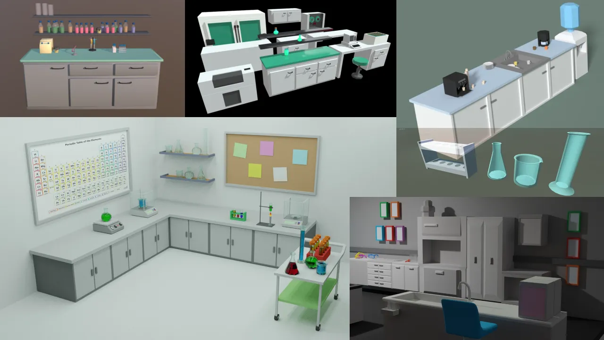

<!-- Inclure le moodboard avec références pour chacune des sources-->

---

[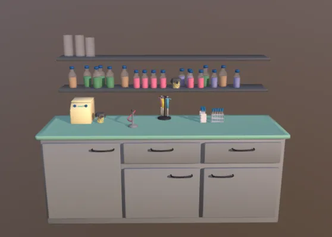](https://sketchfab.com/3d-models/lab-bench-1ac2a62c52a848bbaf746146dc7253f8)

[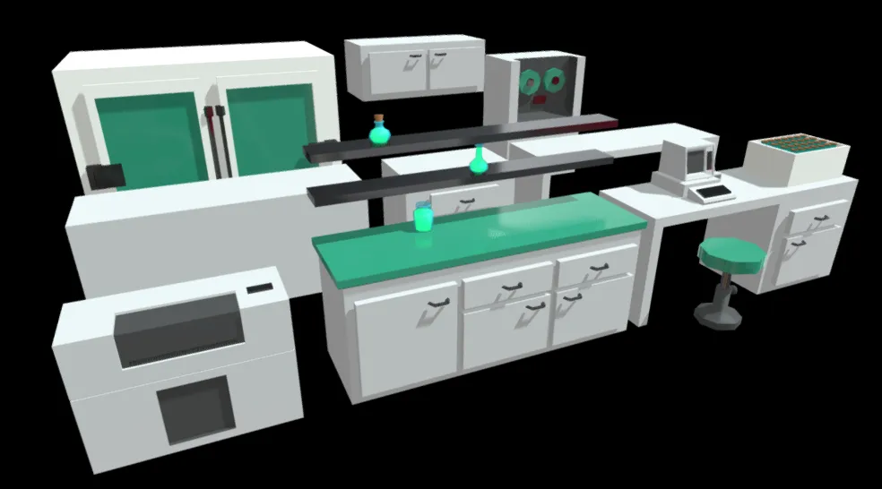](https://sketchfab.com/3d-models/science-lab-lowpoly-e0d65331317b424ca82d317c27652f7f)

[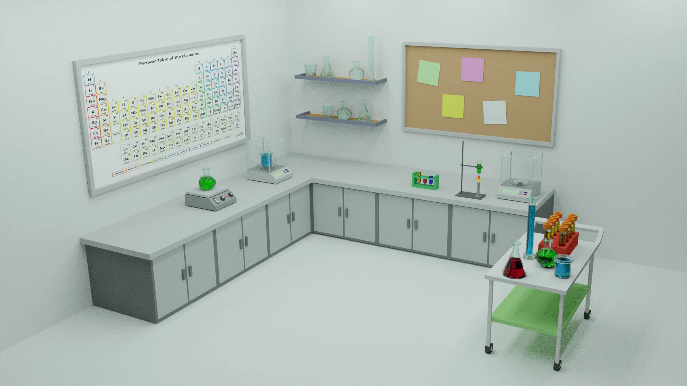](https://ilsevel.artstation.com/projects/N5ar4d)

[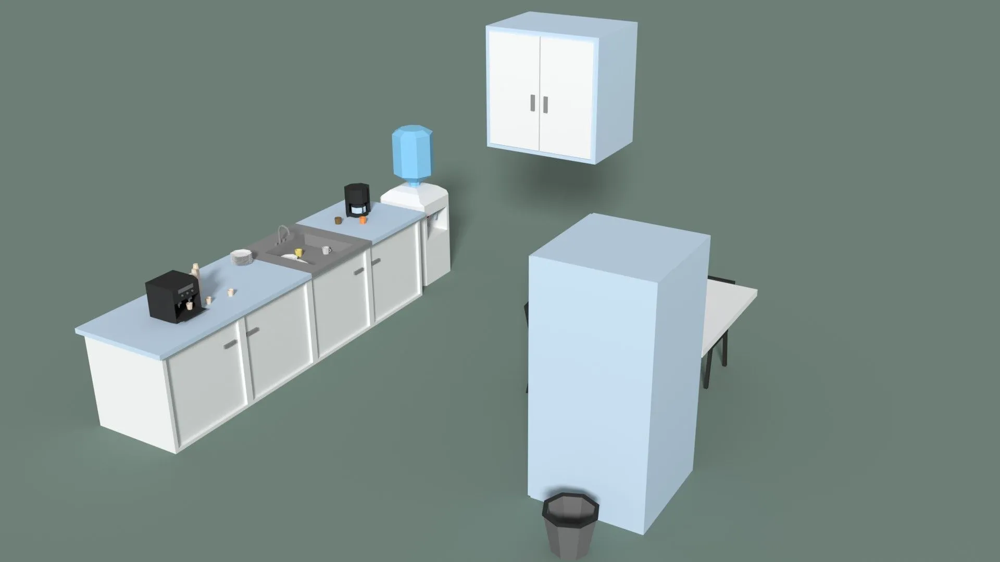](https://free3d.com/3d-model/low-poly-office-kitchen-7016.html)

[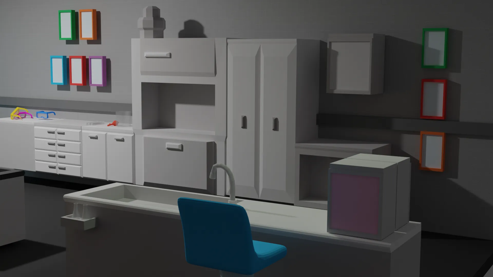](https://www.gamedevmarket.net/asset/low-poly-lab)

[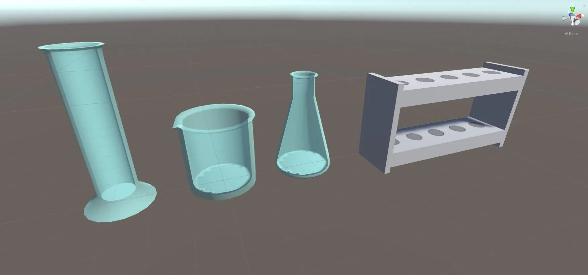](https://free3d.com/3d-model/low-poly-science-kit-laboratory-equipment-package-1055.html)

---

### Planification physique et virtuelle
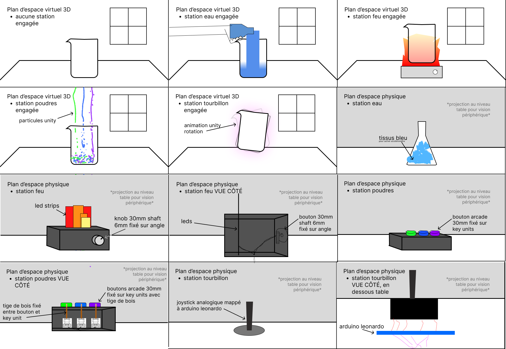


#### Esthétique sonore

On qualifierais notre esthétique sonore comme
- exaggérés
- enjoué
- scintillant
- cartoonesque
- ludique

#### Conception sonore

Notre conception sonore de sert à répliquer la même l’esthétique visuelle et le même style Low-Poly que l'environnement 3D ce qui permet de rendre l'expérience plus interréssante et cartoonesque.
Les sons donnent un retour immédiat au joueur, ce qui rend chaque action claire et agréable à faire.

On s’est inspiré de Super Mario en créant des sons courts, percutants et conçus pour récompenser l’interaction. On s’est également inspiré d’Animal Crossing, en faisant en sorte que nos sons accompagnent le jeu sans capter trop l’attention, tout en permettant à l’interacteur de se repérer avec les sons.

Au final, nos sons aident l’interacteur à mieux comprendre et apprécier l’expérience. La conception sonore se résume à des sons exaggérés, qui reflètent l'aspect "low-poly"/"cartoon" de l'expérience.


#### Ambiance sonore
[Inspiration de son réactif lorsqu'un changement quelconque est fait à la potion](eau_bulles.mp3)
[Inspiration de son réactif lorsque quelqu'un verse de l'eau à la station Eau](eau_verse.mp3)
[Inspiration de son lorsqu'on ouvre le brûleur](feu_allume.mp3)
[Inspiration de son de feu constant, crépitements, lorsque le brûleur est allumé](feu_constant.mp3)
[Inspiration de son de théière qui cri](théière_cri.mp3)
[Inspiration de son d'explosion quand la potion est devenu instable](son_explosion.mp3)
Inspiration de 3 sons qu'on va combiner ensemble pour créer le son de victoire quand la potion est stabilisé
[son de jeux vidéos pixelisé](jeux_vidéos_pixel.mp3)
[Son de chorale d'anges](chorale_anges.mp3)
[Son qui annonce la victoire en disant 'You](voix_victoire.mp3)

<!--
Images inspirantes
Représentations visuelles de l'ambiance recherchée, que ce soit à travers des photographies, des illustrations, ou des œuvres existantes.

Palette de couleurs
Choix de couleurs qui influenceront l'éclairage, les médias projetés, ou l'interface visuelle.

Références multimédia
Vidéos, musiques ou sons, séquences animées qui capturent l'énergie ou la tonalité souhaitée pour l'installation.

Textures et matériaux
Échantillons ou représentations de matériaux tangibles qui seront utilisés dans l'installation (écrans, surfaces tactiles, objets physiques interactifs).

Ambiance sonore et lumineuse
Inspirations relatives à la scénarisation de la lumière et du son, qui seront des éléments interactifs clés dans l'expérience utilisateur.
-->


### Inspirations interactives

[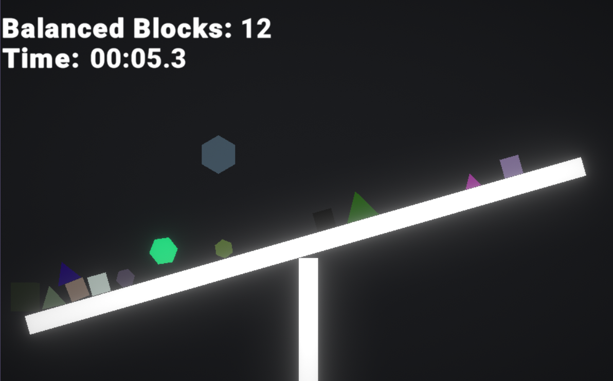](https://zsharpfire.itch.io/equilibrium)
Equilibrium est un jeu avec la notion d'équilibre semblabe à celle de nos stations qui sont défiées par des événements. Le but est de placer des formes sur une balance le plus longtemps possible sans qu'elle perde l'équilibre. La notion de temps est pareille que la nôtre, le but est de garder l'équilibre de la potion face aux défis et de battre son temps records.


[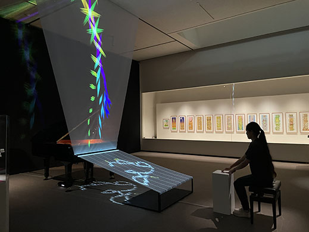](https://artelectronicmedia.com/en/artwork/piano-as-an-image-media-2/)
Installation interactive et immersive qui utilise un objet physique en temps réel. L'interaction sur un objet permet d'influencer ce qui se passe sur la toile. Chaque action permet de produire un son et génère une image ou une forme visuelle animée projetée. La ressemblance entre ce projet et le notre  est que l'interaction passe par un objet physique et une relation geste puis résultat visuelle.


## Scénarimage

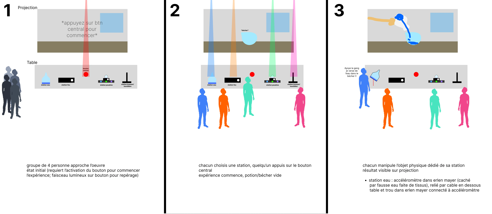
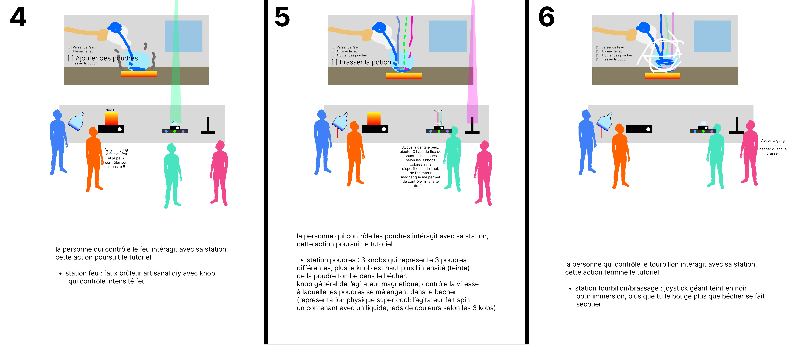
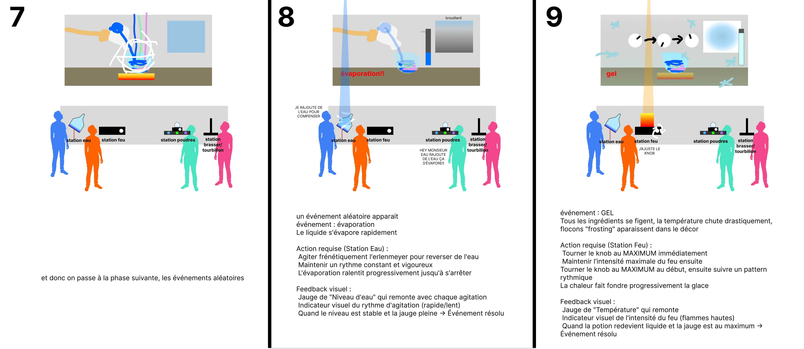
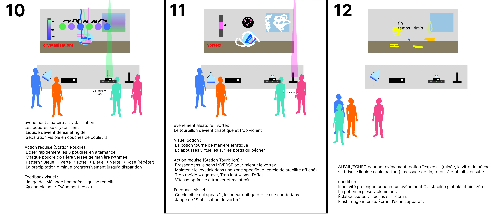
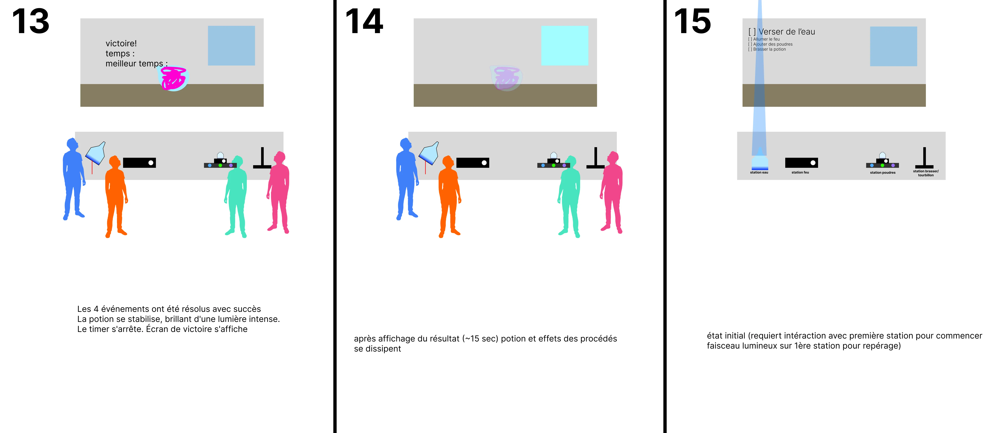

<!-- Pour chaque étape/scène : une image avec du texte descriptif et une explication de la transition -->

<!--
Éléments du scénarimage
Séquence visuelle
Chaque scène ou séquence du scénarimage doit être clairement illustrée, montrant les éléments visuels qui seront projetés ou affichés. Cette séquence visuelle peut inclure des captures d'écran, des croquis ou des rendus 3D, en fonction des besoins du projet.

Points d'interaction
Le scénarimage dans un cadre interactif inclut les moments où l'utilisateur interagit avec l'installation. Ces points d'interaction doivent être représentés graphiquement pour indiquer comment et quand l'utilisateur influencera la progression du récit ou des effets visuels et sonores.

Évolution du récit
Comme pour le scénario narratif, le scénarimage doit montrer la progression de l'histoire ou de l'expérience au fil des interactions. Il permet de visualiser comment l'installation évolue en fonction des actions de l'utilisateur, avec des embranchements possibles selon ses choix.

Retour visuel et sensoriel
Le scénarimage doit inclure des annotations ou des visuels montrant les réponses visuelles, sonores ou tactiles à chaque interaction. Cela peut inclure des changements d'éclairage, des transitions vidéo, ou des effets sonores qui réagissent aux actions de l'utilisateur.
-->

## Mécaniques de jeu

**Structure de partie :**
```
Tutoriel progressif → Événement 1 → Événement 2 → Événement 3 → Événement 4 → Fin
                      (aléatoire)   (aléatoire)   (aléatoire)   (aléatoire)
```

**Timer global** : Démarre au début, s'arrête à la fin  
**Objectif** : Temps le plus court possible

### Phase de démarrage - Tutoriel progressif

Le tutoriel débloque les stations une à la fois pour que les participants apprennent les contrôles avant le début des événements.

#### État initial

| Élément | Description |
|---------|-------------|
| **Écran d'accueil** | Projection du laboratoire avec bécher vide au centre |
| **Faisceau lumineux** | Illumine uniquement la station Eau |
| **Checklist affichée** | "☐ 1. Verser de l'eau" |
| **État des stations** | Seule la station Eau est active |

#### Séquence de déblocage

| Étape | Station | Action requise | Feedback visuel | Feedback sonore | Résultat |
|-------|---------|----------------|-----------------|-----------------|----------|
| **1** | Eau | Agiter l'erlenmeyer | Main virtuelle verse l'eau, niveau monte<br>"✓ 1. Verser de l'eau" | Son d'eau + Note de validation | Station Feu se débloque |
| **2** | Feu | Tourner le knob | Feu s'allume sous le bécher<br>"✓ 2. Allumer le feu" | Flamme crépitante + Note de validation | Station Poudres se débloque |
| **3** | Poudres | Appuyer un (ou plusieurs) bouton(s) de poudre | Flux de poudre colorée tombe<br>"✓ 3. Ajouter des poudres" | Son de poudre + Note de validation | Station Tourbillon se débloque |
| **4** | Tourbillon | Manipuler le joystick | Potion tourbillonne<br>"✓ 4. Brasser la potion" | Son de brassage + Accord de succès | Fin du tutoriel |

#### Fin du tutoriel

| Élément | Description |
|---------|-------------|
| **État des stations** | Les 4 stations sont maintenant actives simultanément |
| **Faisceaux** | Tous s'éteignent |
| **Checklist** | Disparaît |
| **Timer** | Continue (a démarré dès la première action) |
| **Transition** | Le premier événement aléatoire se déclenche après 10 secondes |


### Les 4 événements

Chaque événement se déclenche de manière aléatoire et cible une station spécifique. L'événement dure jusqu'à ce que le participant à cette station le résolve complètement.

#### Événement 1 : Évaporation (Station Eau)

| Aspect | Détail |
|--------|--------|
| **Déclencheur** | Événement aléatoire |
| **Visuel potion** | Le liquide disparaît progressivement (transparence accrue) |
| **Visuel laboratoire** | Flocons "frosting" dans le décor, brouillard dense |
| **Visuel fenêtre** | Brouillard épais à l'extérieur |
| **Action requise** | Agiter frénétiquement l'erlenmeyer pour reverser de l'eau |
| **Feedback** | Jauge "Niveau d'eau" + Indicateur de rythme d'agitation |
| **Résolution** | Maintenir un rythme vigoureux jusqu'à ce que la jauge soit pleine |

#### Événement 2 : Cristallisation (Station Poudres)

| Aspect | Détail |
|--------|--------|
| **Déclencheur** | Événement aléatoire |
| **Visuel potion** | Les poudres se cristallisent, liquide devient dense et rigide, couches colorées visibles |
| **Visuel fenêtre** | Couches de brouillard coloré (bleu/vert/rose) superposées dans le ciel |
| **Action requise** | Doser les 3 poudres en alternance rythmée : Bleue → Verte → Rose (répéter) |
| **Feedback** | Jauge "Mélange homogène" |
| **Résolution** | Continuer le pattern jusqu'à ce que la jauge soit égalisée |

#### Événement 3 : Gel (Station Feu)

| Aspect | Détail |
|--------|--------|
| **Déclencheur** | Événement aléatoire |
| **Visuel potion** | Cristaux de glace sur les parois, potion solidifiée, couleur bleutée/blanchâtre, tourbillon s'arrête |
| **Visuel laboratoire** | Flocons "frosting" apparaissent dans le décor |
| **Visuel fenêtre** | Tempête de neige, givre sur la fenêtre, paysage gelé |
| **Action requise** | Tourner le knob au MAXIMUM au début, ensuite suivre un pattern rythmique |
| **Feedback** | Jauge "Température" + Indicateur d'intensité du feu (flammes hautes en dessous potion) |
| **Résolution** | Maintenir jusqu'à ce que la potion redevienne liquide et la jauge soit pleine |

#### Événement 4 : Vortex (Station Tourbillon)

| Aspect | Détail |
|--------|--------|
| **Déclencheur** | Événement aléatoire |
| **Visuel potion** | Rotation erratique, éclabousses virtuelles sur les bords du bécher |
| **Visuel fenêtre** | Tornade/cyclone dans le ciel |
| **Action requise** | Brasser dans le sens INVERSE, maintenir le joystick dans une zone de stabilité (cercle cible) |
| **Feedback** | Cercle cible à l'écran + Jauge "Stabilisation du vortex" |
| **Résolution** | Garder le curseur dans le cercle jusqu'à ce que la jauge soit pleine |

#### Mécanique de difficulté

| Principe | Explication |
|----------|-------------|
| **Durée variable** | Chaque événement dure selon la performance du participant (pas de durée fixe) |
| **Performance = Temps** | Plus le participant est efficace, plus vite l'événement se résout |
| **Ordre aléatoire** | Les 4 événements arrivent dans un ordre différent à chaque partie |
| **Coopération indirecte** | Les autres participants surveillent et encouragent, mais ne peuvent pas intervenir directement |

#### Condition d'échec

| Situation | Conséquence |
|-----------|-------------|
| **Inaction prolongée** | Si un événement n'est pas résolu assez rapidement |
| **Stabilité à zéro** | La potion se casse → Écran d'échec → Retour au début |
| **Message d'échec** | "La potion est ruinée ! Réessayez." + Temps écoulé avant qu'elle se casse |

#### Phase de fin

| Élément | Description |
|---------|-------------|
| **Condition de succès** | Les 4 événements ont été résolus sans la potion qui se ruine |
| **Timer** | S'arrête immédiatement |
| **Écran de victoire** | Affichage du temps réalisé + Comparaison avec records |
| **Message** | "POTION STABILISÉE !" |
| **Informations affichées** | - Votre temps (ex: 5:32)<br>- Record absolu (ex: 4:12)<br>- Message motivant : "EXCELLENT TRAVAIL D'ÉQUIPE !"<br>- "Pouvez-vous faire mieux ?" |

#### Système de records

| Type de record | Description |
|----------------|-------------|
| **Temps actuel** | Le temps que vient de réaliser l'équipe |
| **Record absolu** | Meilleur temps de tous les temps (persistant) |

#### Tableau récapitulatif

| Station | Événement | Action physique | Durée estimée |
|---------|-----------|-----------------|---------------|
| Eau | Évaporation | Agiter l'erlenmeyer frénétiquement | 30-60 sec |
| Poudres | Cristallisation | Appuyer sur 3 boutons en alternance rythmée | 45-90 sec |
| Feu | Gel | Tourner 1 knob au max + pattern rythmique | 40-70 sec |
| Tourbillon | Vortex | Stabiliser joystick dans zone cible | 50-100 sec |

**Temps total estimé d'une partie :** 2:45 à 6:00 minutes (selon performance)