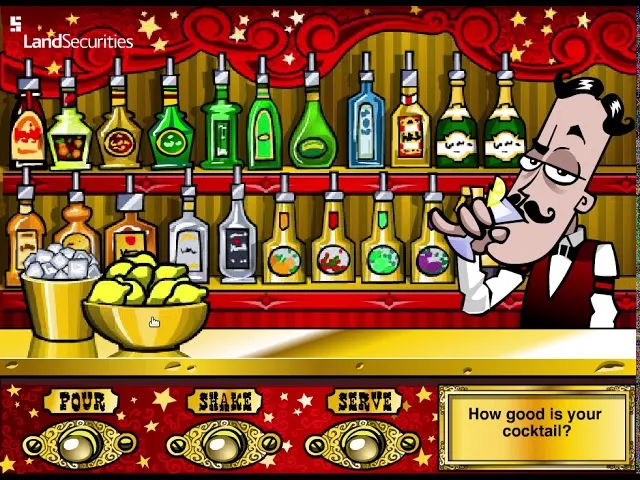
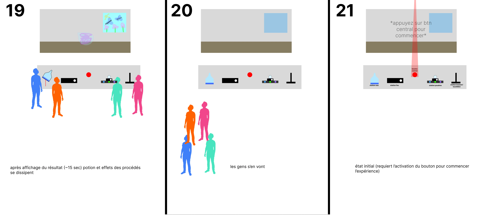

# Concept

## Le pitch initial

<!-- Inclure la vidéo du PowerPoint intial -->

<!-- Méthode 1 -->
<iframe width="560" height="315"
  src="https://www.youtube.com/embed/VOTRE_VIDEO_ID"
  title="YouTube video"
  frameborder="0"
  allowfullscreen>
</iframe>  
    
Symbiose est une installation interactive où quatre apprentis chimistes collaborent pour concocter une potion révolutionnaire. Chaque station contrôle un procédé vital (eau, flamme, poudres, tourbillon) à la création d'une potion. La réussite de la potion ne repose que sur l'équilibre maintenu collectivement. Face à des événements aléatoires qui perturbent constamment cet équilibre, les participants doivent négocier, s'entraider et synchroniser leurs actions pour synthétiser ensemble de nouveaux composés aux propriétés uniques.

<!-- Méthode 2, plug legit -->
<!-- 

-->

<!-- Méthode 3 (vidéo local) -->
<!-- 
 
-->

## L'expérience

### Le parcours de l'interacteur

L'interacteur découvre un laboratoire de chimie projeté et quatre stations physiques disposées autour d'une table. En appuyant sur le bouton central, il déclenche l'apparition d'un bécher vide au centre de la projection. Chaque participant choisit une station et commence à doser son ingrédient : l'un verse de l'eau en agitant un erlenmeyer équipé d'un accéléromètre, un autre contrôle l'intensité du feu via un brûleur avec bouton rotatif et LEDs, un troisième sélectionne et dose des poudres colorées avec un agitateur magnétique, et le dernier brasse la potion à l'aide d'un joystick déguisé. La potion transparente commence à se transformer selon leurs dosages combinés.

Durant la phase de préparation initiale, les participants apprennent à manipuler leurs stations et observent comment leurs actions influencent la potion projetée. Puis, toutes les 1-2 minutes, un événement aléatoire se déclenche : évaporation du liquide, flamme instable, flamme faible, ou gel total. Chaque défi force les participants à réagir rapidement, à communiquer et à s'entraider. La personne à la station liquide doit compenser constamment l'évaporation, celle au feu doit stabiliser les flammes chaotiques ou les maintenir au maximum, et lors du gel, tous doivent agiter frénétiquement leurs stations pour dégeler la potion. Si l'équilibre est rompu, la potion explose et l'expérience recommence.

Après avoir survécu aux quatre événements et maintenu un équilibre stable, la potion se finalise. Une narration révèle alors le nom du nouveau composé créé et ses propriétés. Le résultat visuel se manifeste à travers la fenêtre du laboratoire : explosions et ciel rouge pour une potion explosive, papillons et fleurs pour une potion curative, gaz vert et têtes de mort pour une potion toxique, ou objets flottants et monde inversé pour une potion magique. L'effet se dissipe ensuite, la potion disparaît, et l'installation revient à son état initial, prête pour un nouveau groupe d'apprentis chimistes.

<!-- 
Comportement de l'interacteur
Qu'est-ce que fait l'interacteur?
un résumé du parcours de l'interacteur du début à la fin de son expérience - qu'est-ce qu'il fait, qu'est-ce qu'il manipule, etc
-->

### L'espace

L'espace réel est une salle avec une table centrale équipée de quatre stations physiques authentiques : un erlenmeyer avec tissu bleu cachant un accéléromètre, un brûleur artisanal avec bouton rotatif et LEDs simulant le feu, un agitateur magnétique accompagné de trois boutons de dosage de poudres, et un joystick peint en noir pour la station de brassage (tourbillon). Au-dessus de la table, une projection murale affiche un laboratoire de chimie virtuel en 3D créé avec Unity. Cette projection devient un espace virtuel en temps réel où le bécher central de la projection réagit instantanément aux manipulations physiques des participants.

Les participants partagent une même expérience, à la fois physique et numérique, créant un univers commun où le réel et le virtuel se rejoignent et se prolongent mutuellement. La salle devient un lieu commun où les participants se rassemblent autour de la table, se rapprochent et interagissent dans un même espace physique. Le virtuel amplifie leurs gestes : chaque rotation de bouton, chaque agitation d'erlenmeyer, chaque mouvement de joystick se traduit immédiatement dans la scène 3D. Une main virtuelle verse l'eau, le feu s'intensifie sous le bécher, les poudres colorées tombent en flux continu, et le liquide tourbillonne. Le résultat de leurs actions physiques sur les stations se manifeste visuellement sur la projection murale, transformant leurs manipulations tangibles en alchimie numérique partagée.

<!-- 
description de l'espace réel et virtuel du projet et comment l'espace réel est transposé, transporé ou prolongé dans le virtuel et inversement 
-->

### La progression

La progression dépend du collectif. Chaque station doit maintenir son équilibre pour que la potion survive, tandis qu'un déséquilibre la fait exploser. Le temps devient ainsi le reflet de la coordination humaine. La progression n'est pas imposée, mais essentielle pour la réussite de l'expérience. La progression naît de la collaboration et s'arrête avec l'échec. L'œuvre évoque une perception à la fois subjective et collective du temps, où chaque dosage compte pour maintenir l'existence de la potion et où chaque événement aléatoire teste la capacité du groupe à réagir ensemble.

Les quatre phases marquent clairement cette progression : la préparation libre permet l'apprentissage et l'expérimentation (0-2 minutes), la phase d'alchimie avec défis impose des réactions coordonnées face aux quatre événements aléatoires (2-8 minutes), le résultat final récompense la collaboration réussie par une révélation narrative et visuelle spectaculaire, puis le retour au départ réinitialise l'expérience pour un nouveau groupe. Cette structure cyclique renforce l'idée que la réussite collective est éphémère et doit être reconstituée à chaque fois par de nouveaux participants.

### L'aspect collectif

<!-- 
comment votre idée de projet correspond au thème du COLLECTIF 
Plus il y a de personnes qui peuvent interagir simultanément est un critère important ! 

Un collectif désigne l'ensemble de personnes ou d'entités qui s'unissent de manière concertée pour poursuivre un objectif commun, en coopérant et en collaborant pour atteindre des buts qui seraient difficiles à réaliser individuellement.
 Il peut s'agir d'une réunion informelle ou contractuelle, temporaire ou durable, constituée autour d'une cause, d'une action ou d'un projet, qu'il soit artistique, politique, professionnel, moral ou cultuel.
 Ce groupe, souvent considéré comme une entité à vocation communautaire, fonctionne sous le pilotage de ses membres et repose sur une volonté partagée de développer des solidarités.
-->

L'expérience repose entièrement sur la participation collective de quatre personnes simultanément. Chaque participant contrôle un ingrédient essentiel à la potion, contribuant ainsi à l'équilibre global du système. Plus les quatre participants coordonnent leurs actions, plus la potion se stabilise et progresse vers sa finalisation. Plus la coordination est précise, plus la potion révèle ses propriétés uniques. Le collectif devient ici le moteur même de l'expérience : sans les trois autres, aucun participant ne peut réussir seul à créer la potion. L'œuvre met en valeur la force du « nous », une création née de la cohabitation et de la synchronisation des quatre personnes dans l'espace commun.

L'œuvre repose sur la participation simultanée de quatre stations : chaque station contrôle un ingrédient vital. Lorsque les quatre participants dosent leurs ingrédients en même temps, leurs contributions se combinent pour former une potion collective. Plus la coordination est précise, plus la potion évolue harmonieusement. L'œuvre existe donc grâce au groupe : c'est la présence active des quatre participants qui permet réellement de créer la formule finale. Une seule personne peut manipuler une station, mais c'est seulement lorsque les quatre participants interagissent simultanément que la potion se développe vers un résultat stable et révélateur.

Chaque station ajoute un ingrédient, mais ce sont les autres stations qui donnent un sens à cette contribution en créant un équilibre chimique. Le collectif n'est pas seulement un ensemble de participants : c'est la coopération immédiate entre quatre personnes qui rend possible l'émergence de la potion finale. L'œuvre démontre que certaines créations n'existent que grâce à l'action coordonnée et partagée d'un groupe. Les événements aléatoires renforcent encore cet aspect collectif : lors du gel, tous doivent agir frénétiquement ensemble pour sauver la potion; lors de l'évaporation ou des flammes instables, les autres doivent surveiller et aider la personne en difficulté. Ces défis créent des moments de solidarité spontanée où chacun doit littéralement aider les autres pour que l'expérience continue.

### L'aspect social

<!-- 
comment votre idée de projet correspond au thème du SOCIAL 

Le terme « social » désigne ce qui concerne la vie en société, c'est-à-dire les relations entre les individus au sein d'un groupe organisé, ainsi que les structures, normes et institutions qui en découlent.
 Il peut s'appliquer à des aspects variés, comme la vie sociale, les groupes sociaux, les classes sociales, les rapports de production, ou encore les politiques visant à améliorer les conditions de vie des individus.
 En sciences sociales, le social englobe l'étude des phénomènes collectifs, des interactions humaines, des normes sociales et des dynamiques de pouvoir au sein de la société.
 L'adjectif peut aussi qualifier des animaux ou des plantes vivant en communauté selon des règles strictes, comme les insectes sociaux (fourmis, abeilles) ou certaines espèces végétales formant des colonies denses.
-->

L'aspect social est représenté par la négociation constante entre les participants. "Nous" créons un espace où chaque geste individuel prend sens à travers les autres. Ensemble, les participants équilibrent une potion commune, viable uniquement par la communication et le compromis. L'œuvre illustre comment nos actions isolées peuvent s'unir pour former une réussite collective plus grande que nous-mêmes. En s'entraidant face aux événements, chacun devient conscient de son rôle interdépendant dans un système plus vaste.

L'œuvre représente la manière dont nos interactions, même techniques, tissent des relations de confiance et d'entraide qui renforcent le sentiment d'appartenance à une équipe. L'œuvre illustre à la fois la beauté et la fragilité de la collaboration humaine. La potion sert à représenter visuellement les dynamiques sociales entre les participants. Chaque ingrédient symbolise une contribution individuelle, mais c'est seulement en s'équilibrant avec les autres qu'il permet la réussite. La forme finale de la potion montre que nos dosages isolés deviennent une création commune grâce aux autres.

L'œuvre envoie un message de "l'ensemble est construit uniquement par la coopération humaine". Chaque station représente un rôle individuel, mais elle ne peut aboutir que lorsqu'elle s'harmonise avec les trois autres, comme les individus qui composent une société fonctionnelle. Les événements aléatoires matérialisent la manière dont les défis externes nécessitent une réponse collective coordonnée : fragile, exigeante, mais essentielle. L'œuvre souligne aussi le caractère social de la négociation : les participants doivent constamment communiquer ("J'ai besoin de plus de feu !" / "Non, ça va faire exploser la potion !"), se faire confiance, et accepter des compromis pour maintenir l'équilibre.

La potion devient ainsi une métaphore visuelle du vivre-ensemble : une création commune, élaborée par quatre personnes, toujours en évolution et constamment dépendante des interactions humaines et de la capacité du groupe à s'adapter ensemble aux perturbations. Le résultat final, qu'il soit explosif, curatif, toxique ou magique, reflète directement la qualité de la collaboration sociale qui a eu lieu autour de la table.
 
## Inspirations

### Inspirations visuelles et sonores

<!-- Inclure le moodboard avec références pour chacune des sources-->

---

---

#### Ambiance sonore // À_PRÉCISER
[Inspiration de son réactif lorsqu'un changement quelconque est fait à la potion](eau_bulles.mp3)
[Inspiration de son réactif lorsque quelqu'un verse de l'eau à la station Eau](eau_verse.mp3)
[Inspiration de son lorsqu'on ouvre le brûleur](feu_allume.mp3)
[Inspiration de son de feu constant, crépitements, lorsque le brûleur est allumé](feu_constant.mp3)

<!--
Images inspirantes
Représentations visuelles de l'ambiance recherchée, que ce soit à travers des photographies, des illustrations, ou des œuvres existantes.

Palette de couleurs
Choix de couleurs qui influenceront l'éclairage, les médias projetés, ou l'interface visuelle.

Références multimédia
Vidéos, musiques ou sons, séquences animées qui capturent l'énergie ou la tonalité souhaitée pour l'installation.

Textures et matériaux
Échantillons ou représentations de matériaux tangibles qui seront utilisés dans l'installation (écrans, surfaces tactiles, objets physiques interactifs).

Ambiance sonore et lumineuse
Inspirations relatives à la scénarisation de la lumière et du son, qui seront des éléments interactifs clés dans l'expérience utilisateur.
-->

### Inspirations interactives // À_TERMINER

Bartender: The Right Mix nous a grandement inspiré au niveau du concept de base. Notre projet reprend le concept de mélanger des éléments pour obtenir un résultat loufoque, inattendu. 

[![[AUTRE PROJET]](inspiration2.webp)](URL_PROJET)

## Scénarimage

<!-- Pour chaque étape/scène : une image avec du texte descriptif et une explication de la transition -->

<!--
Éléments du scénarimage
Séquence visuelle
Chaque scène ou séquence du scénarimage doit être clairement illustrée, montrant les éléments visuels qui seront projetés ou affichés. Cette séquence visuelle peut inclure des captures d'écran, des croquis ou des rendus 3D, en fonction des besoins du projet.

Points d'interaction
Le scénarimage dans un cadre interactif inclut les moments où l'utilisateur interagit avec l'installation. Ces points d'interaction doivent être représentés graphiquement pour indiquer comment et quand l'utilisateur influencera la progression du récit ou des effets visuels et sonores.

Évolution du récit
Comme pour le scénario narratif, le scénarimage doit montrer la progression de l'histoire ou de l'expérience au fil des interactions. Il permet de visualiser comment l'installation évolue en fonction des actions de l'utilisateur, avec des embranchements possibles selon ses choix.

Retour visuel et sensoriel
Le scénarimage doit inclure des annotations ou des visuels montrant les réponses visuelles, sonores ou tactiles à chaque interaction. Cela peut inclure des changements d'éclairage, des transitions vidéo, ou des effets sonores qui réagissent aux actions de l'utilisateur.
-->