# Ryan Dufault

## Planification

Cette section, complétée lors de la première semaine, présente les tâches individuelles **hebdomadaires** prévues.

<!--
- Planification sur 9 semaines (8 semaines de cours et 1 semaine de rattrapage) présentant les tâches individuelles hebdomadaires prévues.
- Au moins une tâche par semaine. Les tâches ne peuvent pas se répéter et doivent être suffisamment précises.
- Les tâches doivent être cohérentes avec celles des autres membres de l’équipe et avec le concept du projet, et être mises à jour en continu.
- Critères :
    - Intention et concept clairs
    - Description approfondie de la conception sonore et visuelle
    - Planification détaillée du contenu multimédia à intégrer
    - Planification technique rigoureuse
-->

### Semaine 1

- Faire la liste de choses à acheter pour les TTP     
- Modifier le budget et la liste d'équipement en conséquence     

### Semaine 2

- Réception de données des capteurs (platformIO / arduino)     
    - réception de données d'accéléromètre      
    - réception de données de sliders/faders (x/y)      
- envoie de données sur Unity      

### Semaine 3

- réception de données des capteurs sur Unity       
- développement c# événement gel    

### Semaine 4

- Cablage en dessous table        
- Déboguage capteurs si lieu
- Prendre mesures pour boîtier poudres    
- Dossier de presse sections :       
    - histoire      
    - description   
    - fonctionnalités         

### Semaine 5

- Tournage trailer        
- développement c# tutoriel progressif

### Semaine 6

- Montage vidéo trailer     
- Mapper le joystick analogique avec le arduino leopard  

### Semaine 6.5

- Animation unity de l’événement gel

### Semaine 7

- Update site complet 
- Mapper lumières selon échec/victoire (sem 5-8)

### Semaine 8

- Contrôle qualité (autre partie)

## Journal de bord

Cette section, complétée **quotidiennement** pendant l’exécution du projet, documente le travail individuel réellement réalisé chaque jour.

<!--
- Une entrée par jour sur 8 semaines (8 semaines à partir de la semaine 2).
   - Un total d'au moins 40 entrées uniques!
- Chaque jour :
    - Documentstion visuelle et/ou sonore du travail effectué
    - Lien vers les billets GitHub résolus
- Démarche rigoureuse de validation de la qualité
- Démonstration d'autonomie.
- Exécution technique précise et complète.
- Évaluation réfléchie de la contribution individuelle au travail d’équipe.
-->

### Semaine 2

#### Lundi
- Liste de choses à acheter pour les TTPs
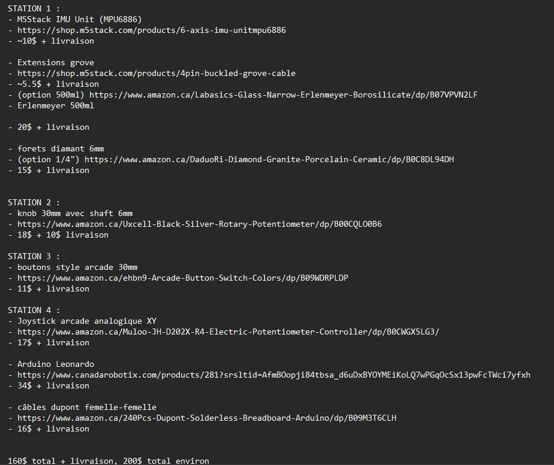

#### Mardi
- Planification physique et virtuelle de l'espace
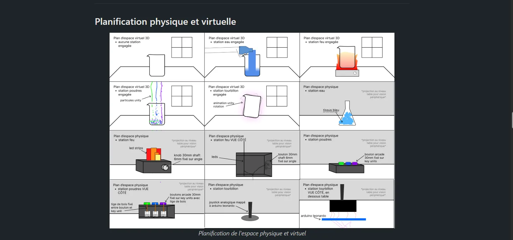

#### Mercredi
- Envoie de données des capteurs via ATOM (sans accel/gyro)
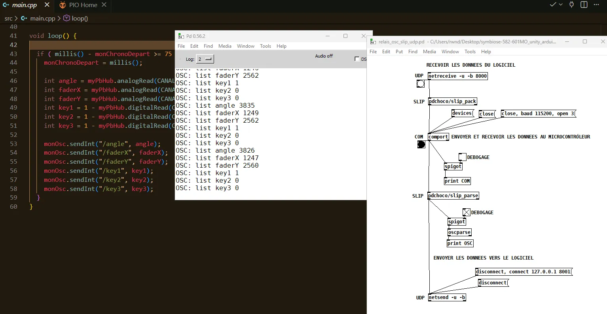

#### Jeudi
- Envoie de données des capteurs via ATOMS3 + patch pure data
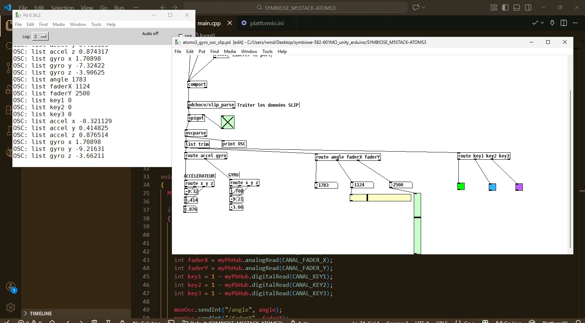

#### Vendredi
- Recevoir les données OSC sur Unity.
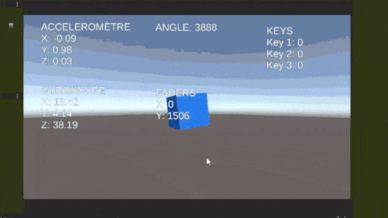
- Patch Pure Data unique au projet avancé.
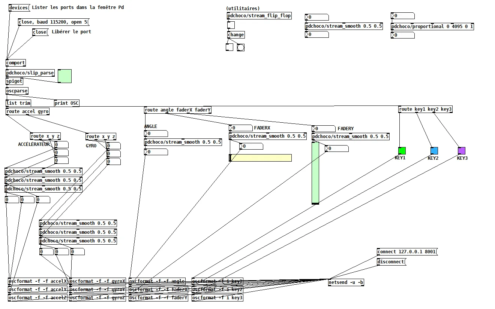

### Semaine 3

#### Lundi
- Capteurs influencent la scène principale. (simple pour maquette #1)
    - L'accéléromètre remplit l'eau au fur et à mesure (scale)
    - L'angle allume le feu/l'éteint progressivement (scale)
    - Les keys changent la couleur du matériau de l'eau (mesh renderer)
    - Les faders rotationnent le bécher (rotation)
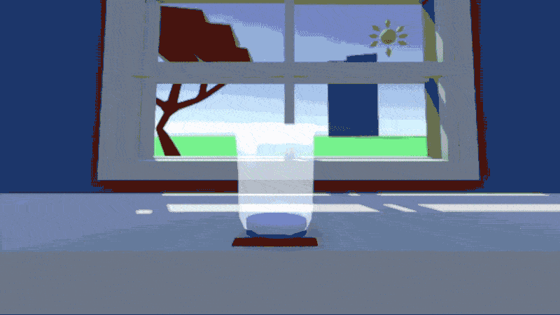

#### Mardi
- Développement de l'événement gel (seul événement disponible pour la maquette #1)
    - Démarre 5 secondes après interaction du fader
    - Barre de gel qui descend lorsque le knob est au max
    - Pattern rythmique à suivre pour faire descendre la barre (angle à tel value ainsi de suite)
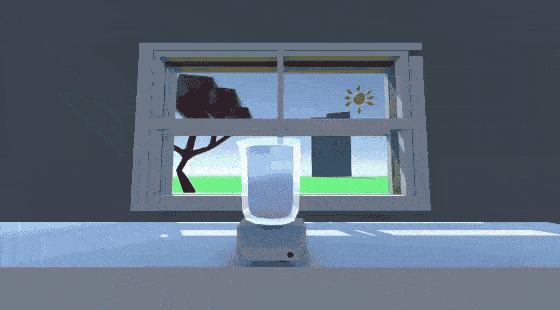

#### Mercredi
- Développement de notion d'échec et de victoire
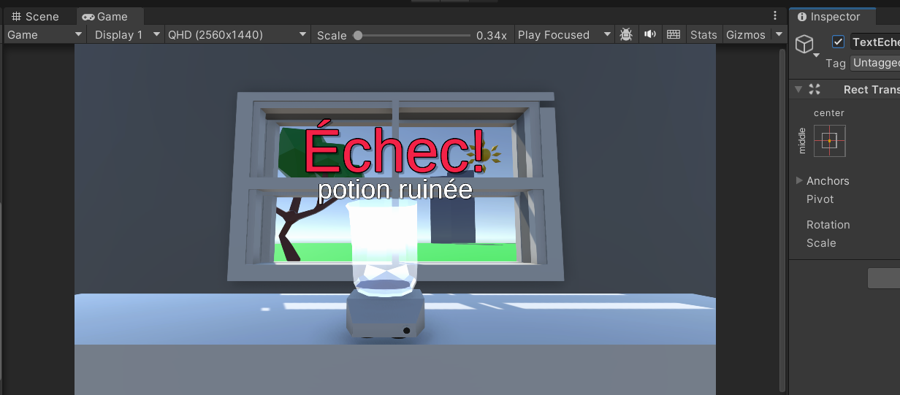
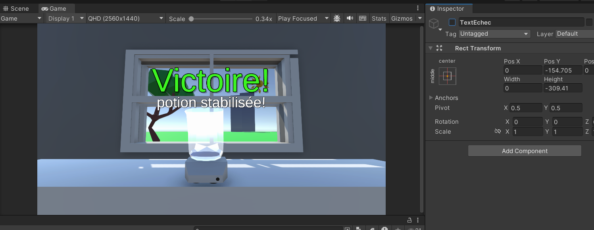

#### Jeudi
- Début d'envoi OSC sur QLC+, ajustements finals pour la maquette #1.
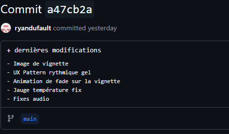
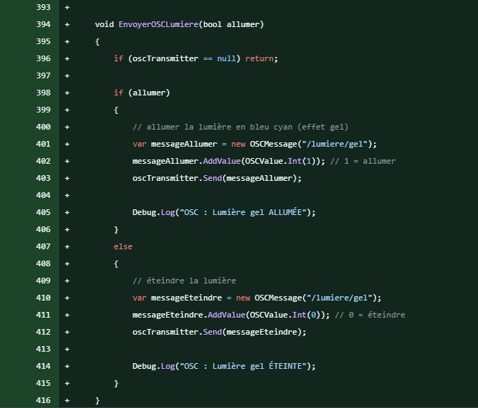

#### Vendredi
- Début de feedback visuel pour chaque station.
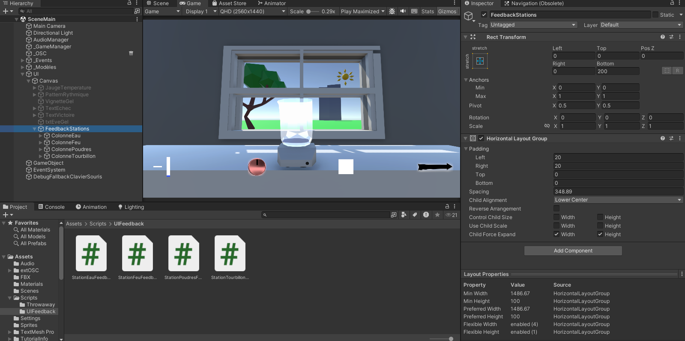

### Semaine 4

#### Lundi
- Clean-up/refactoring du code, supression des bouts de code en lien avec la maquette #1.

#### Mardi
- Avancement du feedback visuel des manipulations continues des stations.
    - L'eau doit atteindre un niveau cible et maintenir son niveau pendant 2 secondes. (Ne marche pas pour l'instant; problème de tolérance/seuil)
    - Le feu doit aussi atteindre une cible et maintenir son intensité pendant 2 secondes.
    - Le bouton correspondant à la couleur du cercle affiché sur l'écran doit être appuyé dans un délai de 2 secondes. (Je vais rajouter une animation de fade out demain pour plus d'intuitivité)
    - Le joystick (faders X/Y pour l'instant) doit faire un rotation dans le sens indiqué de la flèche pendant un X nombre de secondes (anti horaire ou horaire). (Pour l'instant le feedback visuel marche mais pas le système derrière, je vais rajouter un clamp entre 1 et 6 secondes pour le temps de rotation à faire avant le changement de sens de la flèche).
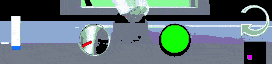

#### Mercredi
- Finitions du feedback visuel des manipulations continues des stations.
    - L'eau doit atteindre un niveau cible et maintenir son niveau pendant 3.5 secondes.
    - Le feu doit aussi atteindre une cible et maintenir son intensité pendant 2 secondes.
    - Le bouton correspondant à la couleur du cercle affiché sur l'écran doit être appuyé dans un délai de 4 secondes.
    - Le joystick (faders X/Y pour l'instant) doit faire un rotation dans le sens indiqué de la flèche pendant un X nombre de secondes (anti horaire ou horaire).
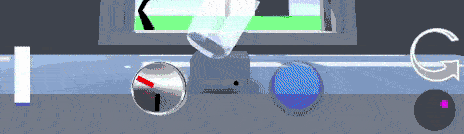
- Début du tutoriel progressif
- Début du TouchDesigner pour la 2ème projection (projection ultra wide)
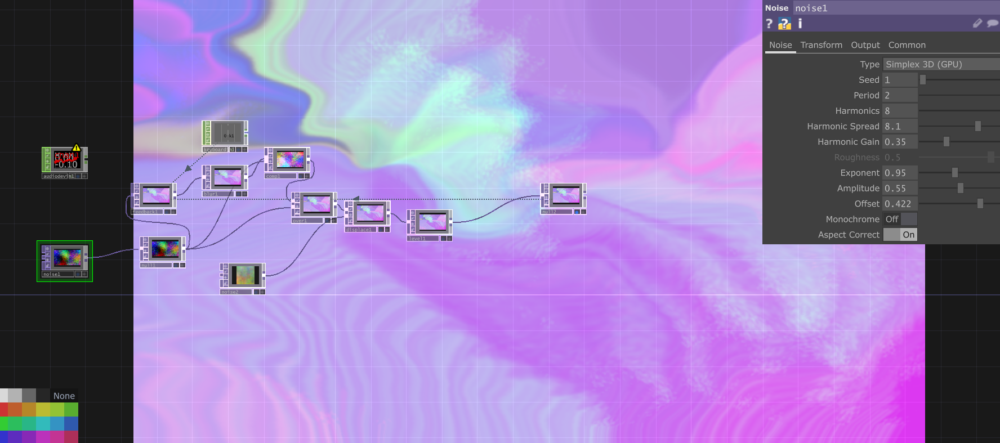
    - Je pense faire en sorte que chaque niveau d'eau atteint (via manip. continue de la station eau) fasse un pulse reset sur le top feedback
    - Que l'angle de la station feu ajoute de la saturation (ou des harmonics du noise, à voir)
    - Que les keys changent la couleur du noise
    - Que le tourbillon change le translate 4D du 2ème noise
    - L'événement évaporation enlève de la saturation (genre complètement)
    - L'événement gel "freeze"/slow le translate 4D du 2ème noise (et donne une teinte bleuté clair)
    - L'événement crystallisation rajoute beaucoup d'harmonics sur les 2 noise (poure donner l'effet de "grain") (je pourrais même rajouter un 3ème noise, à voir)
    - L'événement vortex pourrait accélérer le translate 4D du 2ème noise (et faire un effet de clignotement sur la projection?, à voir)
    - Victoire = saturation boosté
    - Échec = saturation basse
<!-- Finitions du feedback visuel des manipulations continues + Début du tutoriel progressif -->

#### Jeudi
<!-- Tutoriel progressif complété idéalement, acheter les matériaux nécéssaires-->
- J'ai passé la majorité de la journée à debug platformio.
- Après je suis allé acheter le matériel électronique nécéssaire concernant la station tourbillon du projet (celle avec le joystick).

#### Vendredi
<!-- Début structure événements aléatoires -->

### Semaine 5 <!-- Semaine concentrée sur les événements aléatoires, semaine 6 idéalement système de temps, semaine 7+ finitions (ui, ux, etc..)-->

#### Lundi

#### Mardi

#### Mercredi

#### Jeudi

#### Vendredi

### Semaine 6

#### Lundi

#### Mardi

#### Mercredi

#### Jeudi

#### Vendredi

### Semaine 6.5

#### Lundi

#### Mardi

#### Mercredi

#### Jeudi

#### Vendredi

### Semaine 7

#### Lundi

#### Mardi

#### Mercredi

#### Jeudi

#### Vendredi

### Semaine 8

#### Lundi

#### Mardi

#### Mercredi

#### Jeudi

#### Vendredi
                                                   
