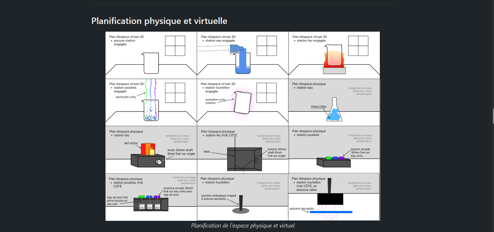
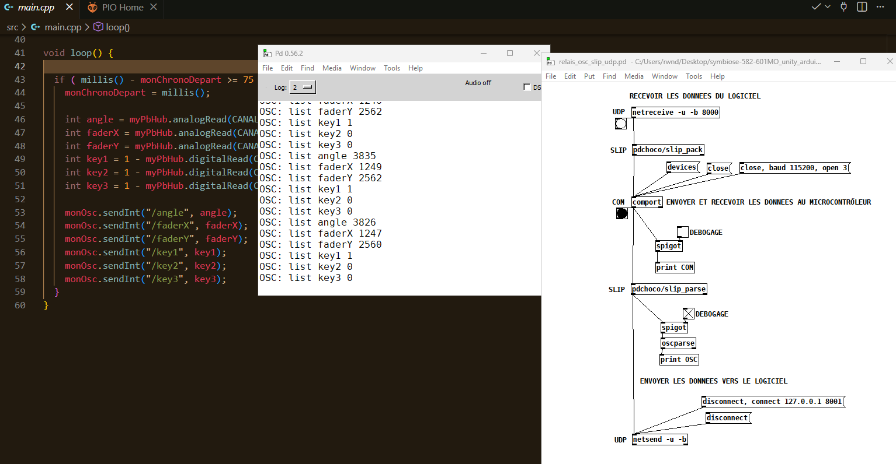
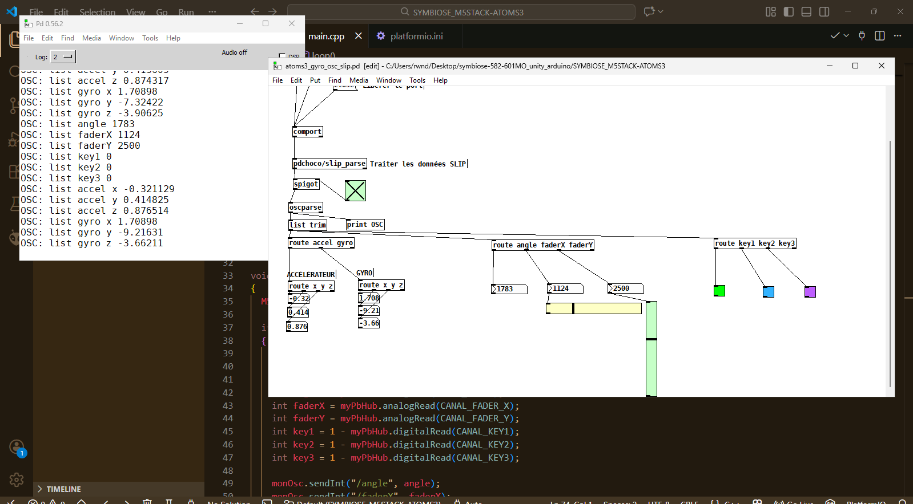

# Ryan Dufault

## Planification

Cette section, complétée lors de la première semaine, présente les tâches individuelles **hebdomadaires** prévues.

<!--
- Planification sur 9 semaines (8 semaines de cours et 1 semaine de rattrapage) présentant les tâches individuelles hebdomadaires prévues.
- Au moins une tâche par semaine. Les tâches ne peuvent pas se répéter et doivent être suffisamment précises.
- Les tâches doivent être cohérentes avec celles des autres membres de l’équipe et avec le concept du projet, et être mises à jour en continu.
- Critères :
    - Intention et concept clairs
    - Description approfondie de la conception sonore et visuelle
    - Planification détaillée du contenu multimédia à intégrer
    - Planification technique rigoureuse
-->

### Semaine 1

- Faire la liste de choses à acheter pour les TTP     
- Modifier le budget et la liste d'équipement en conséquence     

### Semaine 2

- Réception de données des capteurs (platformIO / arduino)     
    - réception de données d'accéléromètre      
    - réception de données de sliders/faders (x/y)      
- envoie de données sur Unity      

### Semaine 3

- réception de données des capteurs sur Unity       
- développement c# événement gel    

### Semaine 4

- Cablage en dessous table        
- Déboguage capteurs si lieu
- Prendre mesures pour boîtier poudres    
- Dossier de presse sections :       
    - histoire      
    - description   
    - fonctionnalités         

### Semaine 5

- Tournage trailer        
- développement c# tutoriel progressif

### Semaine 6

- Montage vidéo trailer     
- Mapper le joystick analogique avec le arduino leopard  

### Semaine 6.5

- Animation unity de l’événement gel

### Semaine 7

- Update site complet 
- Mapper lumières selon échec/victoire (sem 5-8)

### Semaine 8

- Contrôle qualité (autre partie)

## Journal de bord

Cette section, complétée **quotidiennement** pendant l’exécution du projet, documente le travail individuel réellement réalisé chaque jour.

<!--
- Une entrée par jour sur 8 semaines (8 semaines à partir de la semaine 2).
   - Un total d'au moins 40 entrées uniques!
- Chaque jour :
    - Documentstion visuelle et/ou sonore du travail effectué
    - Lien vers les billets GitHub résolus
- Démarche rigoureuse de validation de la qualité
- Démonstration d'autonomie.
- Exécution technique précise et complète.
- Évaluation réfléchie de la contribution individuelle au travail d’équipe.
-->

### Semaine 2

#### Lundi
- Liste de choses à acheter pour les TTPs

#### Mardi
- Planification physique et virtuelle de l'espace

#### Mercredi
- Envoie de données des capteurs via ATOM (sans accel/gyro)

#### Jeudi
- Envoie de données des capteurs via ATOMS3 + patch pure data

#### Vendredi
<!-- Receive sur Unity; Début effets sur scène genre avec un cube -->

### Semaine 3

#### Lundi
<!-- Chaque capteurs fait quelque chose sur la scène -->

#### Mardi
<!-- Événement gel -->

#### Mercredi
<!-- Notion de fin et d'état initial pour maquette #1 (genre écran fin Échec! écran victoire Victoire!)-->

#### Jeudi
<!-- débuggage possible, sinon qlc+ dernier touchups pour maquette#1-->

#### Vendredi

### Semaine 4

#### Lundi

#### Mardi

#### Mercredi

#### Jeudi

#### Vendredi

### Semaine 5

#### Lundi

#### Mardi

#### Mercredi

#### Jeudi

#### Vendredi

### Semaine 6

#### Lundi

#### Mardi

#### Mercredi

#### Jeudi

#### Vendredi

### Semaine 6.5

#### Lundi

#### Mardi

#### Mercredi

#### Jeudi

#### Vendredi

### Semaine 7

#### Lundi

#### Mardi

#### Mercredi

#### Jeudi

#### Vendredi

### Semaine 8

#### Lundi

#### Mardi

#### Mercredi

#### Jeudi

#### Vendredi
                                                   
