# Ryan Dufault

## Planification

Cette section, complétée lors de la première semaine, présente les tâches individuelles **hebdomadaires** prévues.

<!--
- Planification sur 9 semaines (8 semaines de cours et 1 semaine de rattrapage) présentant les tâches individuelles hebdomadaires prévues.
- Au moins une tâche par semaine. Les tâches ne peuvent pas se répéter et doivent être suffisamment précises.
- Les tâches doivent être cohérentes avec celles des autres membres de l’équipe et avec le concept du projet, et être mises à jour en continu.
- Critères :
    - Intention et concept clairs
    - Description approfondie de la conception sonore et visuelle
    - Planification détaillée du contenu multimédia à intégrer
    - Planification technique rigoureuse
-->

### Semaine 1

- Faire la liste de choses à acheter pour les TTP     
- Modifier le budget et la liste d'équipement en conséquence     

### Semaine 2

- Réception de données des capteurs (platformIO / arduino)     
    - réception de données d'accéléromètre      
    - réception de données de sliders/faders (x/y)      
- envoie de données sur Unity      

### Semaine 3

- réception de données des capteurs sur Unity       
- développement c# événement gel    

### Semaine 4

- Cablage en dessous table        
- Déboguage capteurs si lieu
- Prendre mesures pour boîtier poudres    
- Dossier de presse sections :       
    - histoire      
    - description   
    - fonctionnalités         

### Semaine 5

- Tournage trailer        
- développement c# tutoriel progressif

### Semaine 6

- Montage vidéo trailer     
- Mapper le joystick analogique avec le arduino leopard  

### Semaine 6.5

- Animation unity de l’événement gel

### Semaine 7

- Update site complet 
- Mapper lumières selon échec/victoire (sem 5-8)

### Semaine 8

- Contrôle qualité (autre partie)

## Journal de bord

Cette section, complétée **quotidiennement** pendant l’exécution du projet, documente le travail individuel réellement réalisé chaque jour.

<!--
- Une entrée par jour sur 8 semaines (8 semaines à partir de la semaine 2).
   - Un total d'au moins 40 entrées uniques!
- Chaque jour :
    - Documentstion visuelle et/ou sonore du travail effectué
    - Lien vers les billets GitHub résolus
- Démarche rigoureuse de validation de la qualité
- Démonstration d'autonomie.
- Exécution technique précise et complète.
- Évaluation réfléchie de la contribution individuelle au travail d’équipe.
-->

### Semaine 2

#### Lundi
- Liste de choses à acheter pour les TTPs
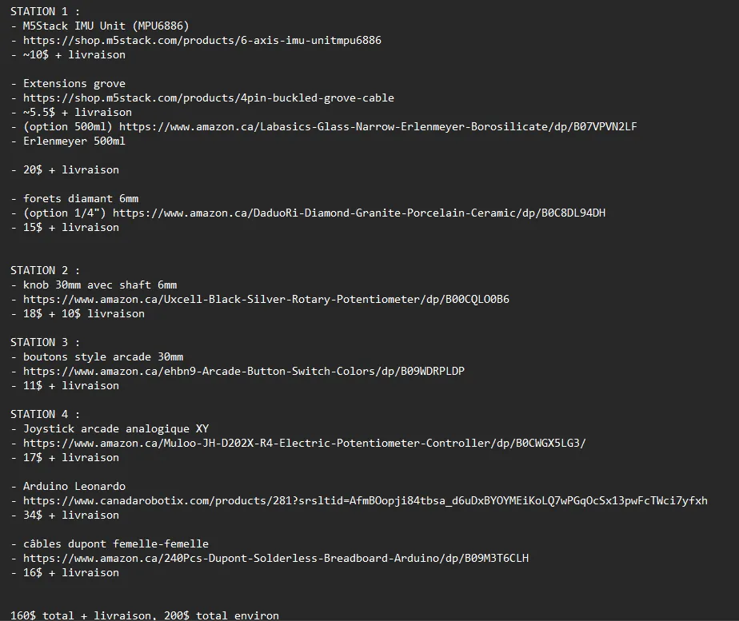

#### Mardi
- Planification physique et virtuelle de l'espace
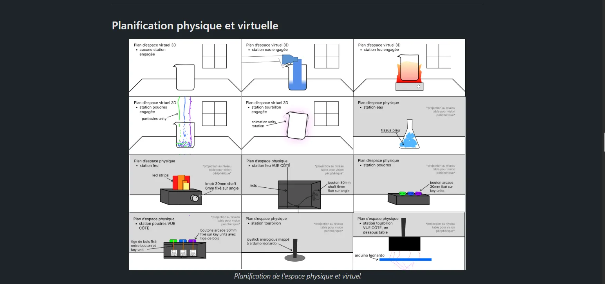

#### Mercredi
- Envoie de données des capteurs via ATOM (sans accel/gyro)
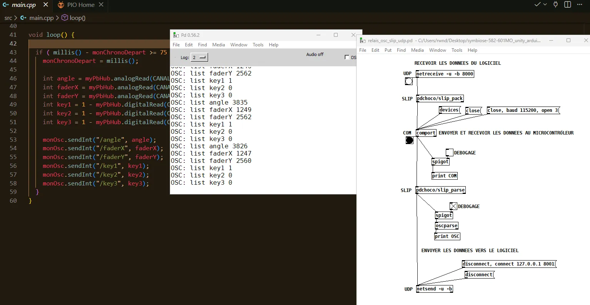

#### Jeudi
- Envoie de données des capteurs via ATOMS3 + patch pure data
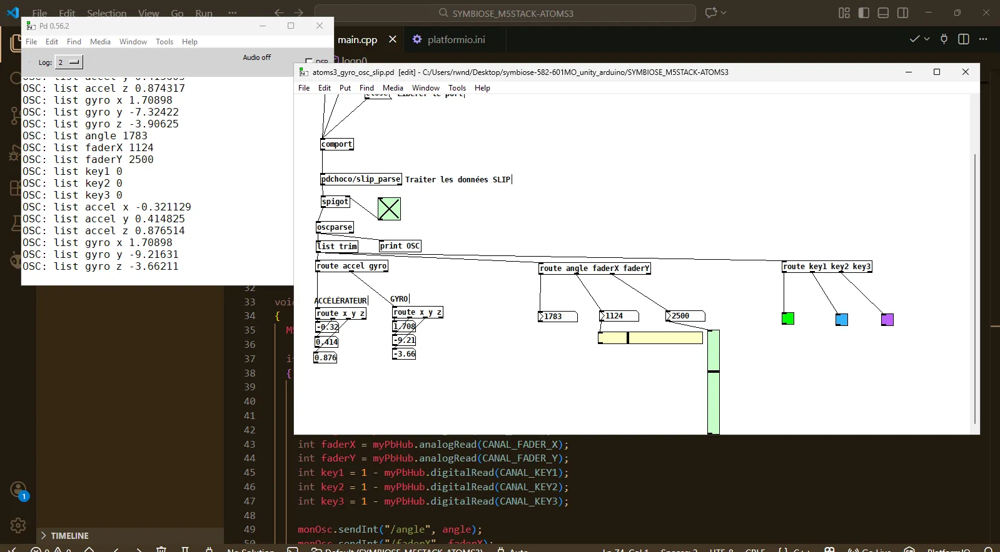

#### Vendredi
- Recevoir les données OSC sur Unity.
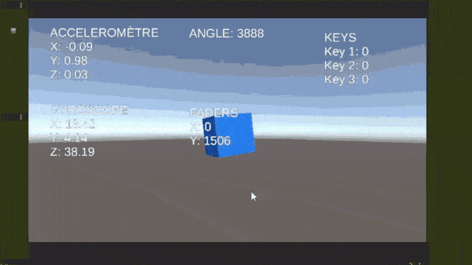
- Patch Pure Data unique au projet avancé.
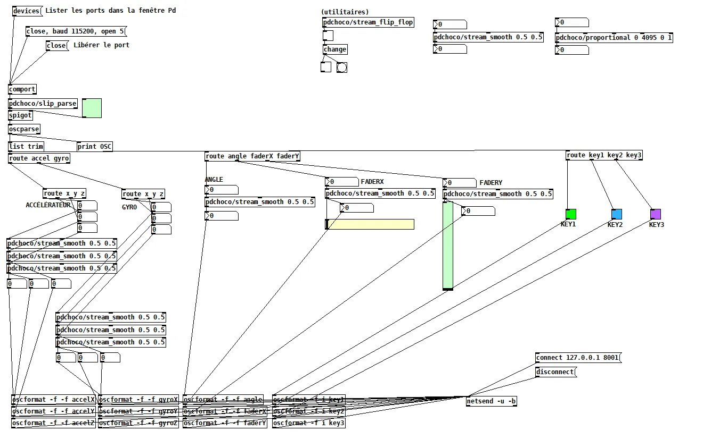

### Semaine 3

#### Lundi
- Capteurs influencent la scène principale. (simple pour maquette #1)
    - L'accéléromètre remplit l'eau au fur et à mesure (scale)
    - L'angle allume le feu/l'éteint progressivement (scale)
    - Les keys changent la couleur du matériau de l'eau (mesh renderer)
    - Les faders rotationnent le bécher (rotation)
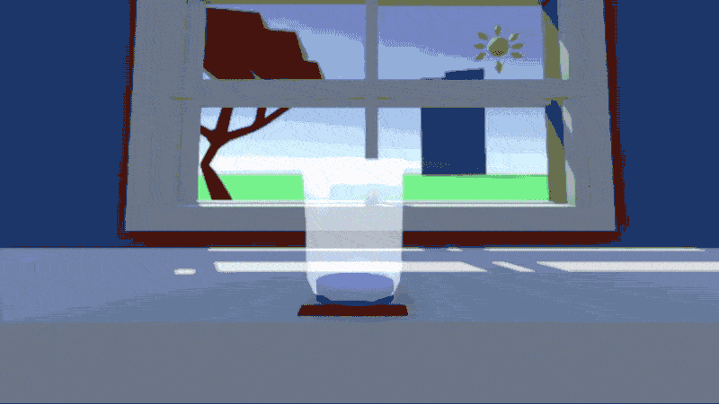

#### Mardi
- Développement de l'événement gel (seul événement disponible pour la maquette #1)
    - Démarre 5 secondes après interaction du fader
    - Barre de gel qui descend lorsque le knob est au max
    - Pattern rythmique à suivre pour faire descendre la barre (angle à tel value ainsi de suite)
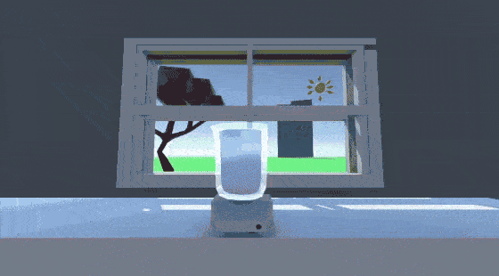

#### Mercredi
- Développement de notion d'échec et de victoire
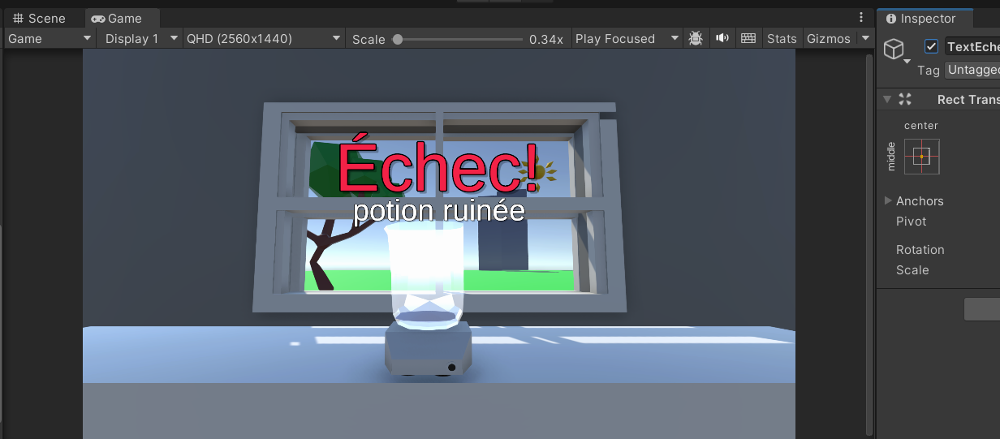
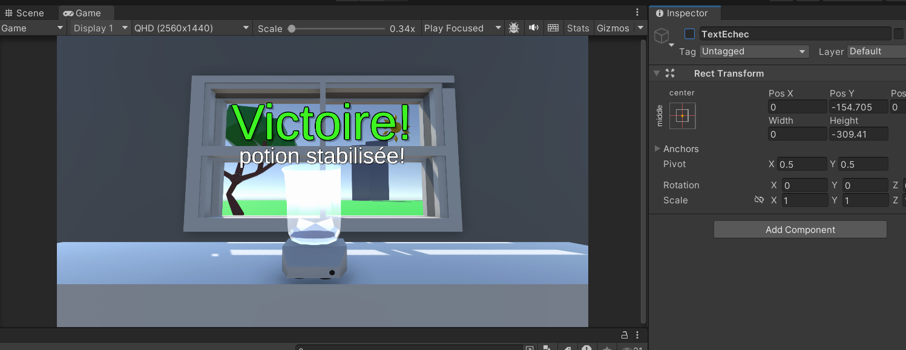

#### Jeudi
- Début d'envoi OSC sur QLC+, ajustements finals pour la maquette #1.
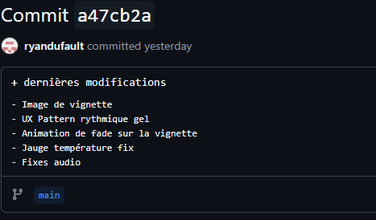
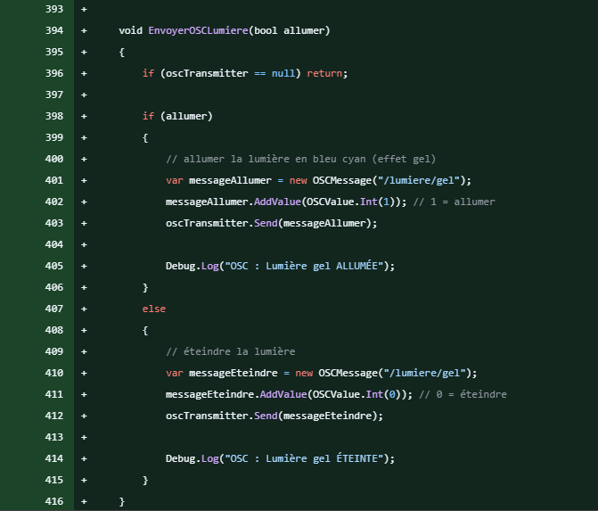

#### Vendredi
- Début de feedback visuel pour chaque station.
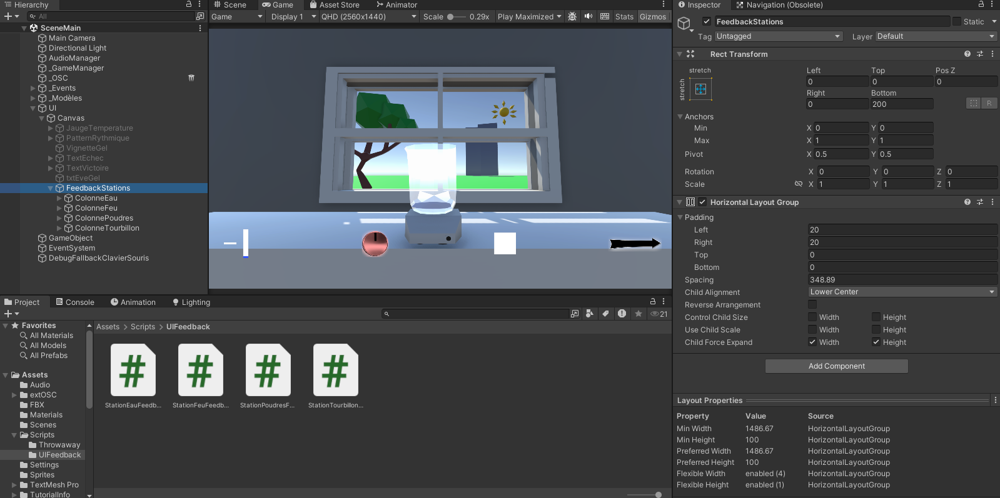

### Semaine 4

#### Lundi
- Clean-up/refactoring du code, supression des bouts de code en lien avec la maquette #1.

#### Mardi
- Avancement du feedback visuel des manipulations continues des stations.
    - L'eau doit atteindre un niveau cible et maintenir son niveau pendant 2 secondes. (Ne marche pas pour l'instant; problème de tolérance/seuil)
    - Le feu doit aussi atteindre une cible et maintenir son intensité pendant 2 secondes.
    - Le bouton correspondant à la couleur du cercle affiché sur l'écran doit être appuyé dans un délai de 2 secondes. (Je vais rajouter une animation de fade out demain pour plus d'intuitivité)
    - Le joystick (faders X/Y pour l'instant) doit faire un rotation dans le sens indiqué de la flèche pendant un X nombre de secondes (anti horaire ou horaire). (Pour l'instant le feedback visuel marche mais pas le système derrière, je vais rajouter un clamp entre 1 et 6 secondes pour le temps de rotation à faire avant le changement de sens de la flèche).
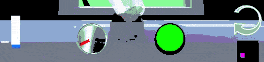

#### Mercredi
- Finitions du feedback visuel des manipulations continues des stations.
    - L'eau doit atteindre un niveau cible et maintenir son niveau pendant 3.5 secondes.
    - Le feu doit aussi atteindre une cible et maintenir son intensité pendant 2 secondes.
    - Le bouton correspondant à la couleur du cercle affiché sur l'écran doit être appuyé dans un délai de 4 secondes.
    - Le joystick (faders X/Y pour l'instant) doit faire un rotation dans le sens indiqué de la flèche pendant un X nombre de secondes (anti horaire ou horaire).
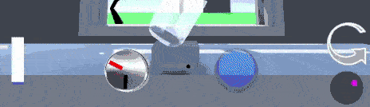
- Début du tutoriel progressif
- Début du TouchDesigner pour la 2ème projection (projection ultra wide)
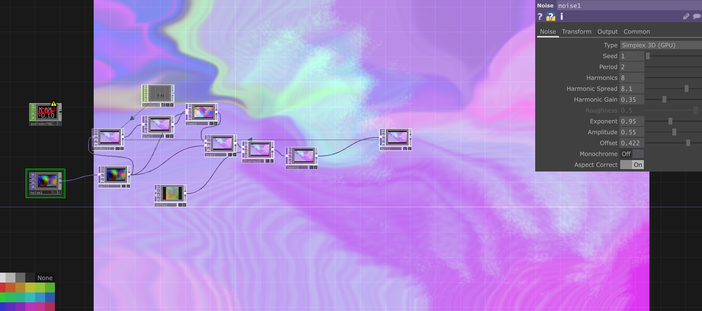
    - Je pense faire en sorte que chaque niveau d'eau atteint (via manip. continue de la station eau) fasse un pulse reset sur le top feedback
    - Que l'angle de la station feu ajoute de la saturation (ou des harmonics du noise, à voir)
    - Que les keys changent la couleur du noise
    - Que le tourbillon change le translate 4D du 2ème noise
    - L'événement évaporation enlève de la saturation (genre complètement)
    - L'événement gel "freeze"/slow le translate 4D du 2ème noise (et donne une teinte bleuté clair)
    - L'événement crystallisation rajoute beaucoup d'harmonics sur les 2 noise (poure donner l'effet de "grain") (je pourrais même rajouter un 3ème noise, à voir)
    - L'événement vortex pourrait accélérer le translate 4D du 2ème noise (et faire un effet de clignotement sur la projection?, à voir)
    - Victoire = saturation boosté
    - Échec = saturation basse
<!-- Finitions du feedback visuel des manipulations continues + Début du tutoriel progressif -->

#### Jeudi
<!-- Tutoriel progressif complété idéalement, acheter les matériaux nécéssaires-->
- J'ai passé la majorité de la journée à debug platformio.
- Après je suis allé acheter le matériel électronique nécéssaire concernant la station tourbillon du projet (celle avec le joystick).

#### Vendredi
- J'ai complété le tutoriel progressif
    - En premier il faut verser de l'eau au niveau indiqué
    - Ensuite, il faut allumer le feu à l'intensité indiquée
    - Ensuite, il faut appuyer sur les boutons en fonction de la couleur demandée
    - Ensuite, il faut "tourner" (faders x/y pour l'instant) dans le sens de la flèche
    - Ensuite, la phase principale de l'expérience démarre.
- J'ai fait le début du système de stabilité globale (seulement UI pour l'instant)
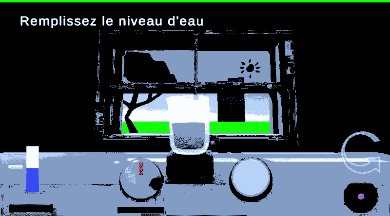

### Semaine 5 <!-- Semaine concentrée sur les événements aléatoires, semaine 6 idéalement système de temps, semaine 7+ finitions (ui, ux, etc..)-->

#### Lundi
- J'ai commencé à mix le son de chorale à partir de nos voix enregistrées.
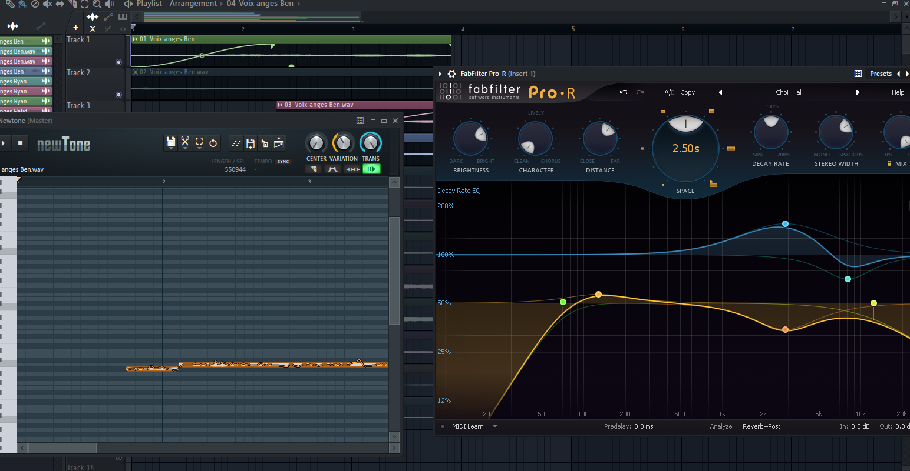
- J'ai découpé et assemblé des morceaux de bois pour faire des caissons qui serviront de boîtes pour nos stations.

#### Mardi
- Événement gel terminé
    - Il faut en premier tourner le knob au complet pour augmenter l'intensité de la chaleur.
    - Ensuite, selon le temps, un nombre de knob spécifique apparaît.
    - Il faut tourner le knob en fonction de la cible demandée (tiret rouge) et suivre le pattern.
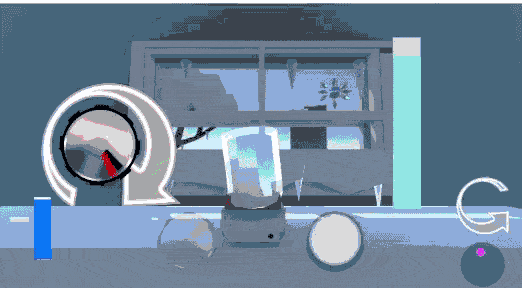

#### Mercredi
- Événement évaporation terminé
    - Il faut secouer l'erlen meyer (l'accéléromètre) de façon appropriée.
<figure>
  

    <video controls style="width: 100%; height: 100%;">
      <source src="/symbiose/equipe/ryan_dufault/s5_mercredi.mp4" type="video/mp4">
    </video>
  

  <figcaption style="text-align: center; font-style: italic;">
    Démonstration de l'événement évaporation.
  </figcaption>
</figure>

#### Jeudi
- Événement cristallisation terminé
    - Il faut appuyer sur le bouton correspondant selon un rythme précis.
<figure>
  

    <video controls style="width: 100%; height: 100%;">
      <source src="/symbiose/equipe/ryan_dufault/s5_jeudi.mp4" type="video/mp4">
    </video>
  

  <figcaption style="text-align: center; font-style: italic;">
    Démonstration de l'événement cristallisation.
  </figcaption>
</figure>

- J'ai fait la liaison entre l'arduino nano et le joystick analogique. J'ai ensuite réadapté le projet PlatformIO et le projet Unity en conséquence)
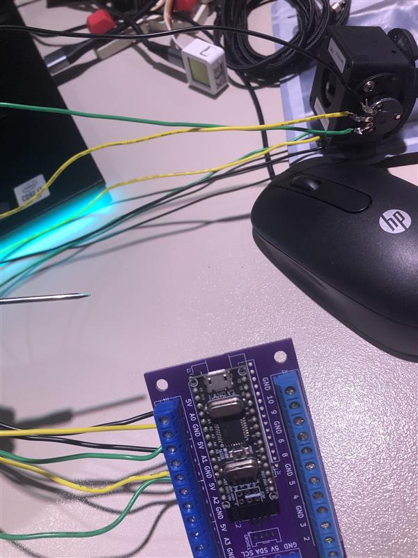

#### Vendredi
- Événement vortex terminé
    - Il faut orienter le joystick de sorte à rester dans la zone verte pour calmer la tornade et la potion qui se fait secouer.

<figure>
  

    <video controls style="width: 100%; height: 100%;">
      <source src="/symbiose/equipe/ryan_dufault/s5_vendredi.mp4" type="video/mp4">
    </video>
  

  <figcaption style="text-align: center; font-style: italic;">
    Démonstration de l'événement vortex.
  </figcaption>
</figure>

### Semaine 6

#### Lundi
- Animation Unity de la main qui verse de l'eau dans le bécher + Post-processing de la scène (saturation, contraste, hdri, etc..)

<figure>
  

    <video controls style="width: 100%; height: 100%;">
      <source src="/symbiose/equipe/ryan_dufault/s6_lundi.mp4" type="video/mp4">
    </video>
  

  <figcaption style="text-align: center; font-style: italic;">
    Démonstration de l'animation de la main qui verse de l'eau.
  </figcaption>
</figure>

- Touch Designer du projet complété
    - À chaque fois que la station eau atteint ça sible, pulse sur le reset du feedback 
    - Le angle (knob) rajoute des harmonics au noise (donne un effet de "grain", d'intensité)   
    - Les boutons changent la couleur globale de la projection (appliquent une teinte)  
    - Le joystick change le feedback de direction   
    - L'événement évaporation diminue la saturation globale de la projection
    - L'événement gel ajoute une teinte bleue clair et une vignette blanchâtre
    - L'événement cristallisation ajoute un dégradé tricolore qui se déplace, en plus d'un overlay de noise (qui est modifiée de sorte à ressembler à des cristaux)
    - L'événement vortex fait trembler le feedback en plus de rétrécir le scale des noise
    - L'échec fait clignoter un dégradé rouge
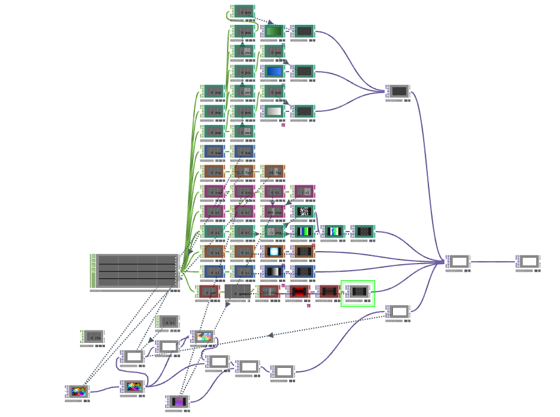

#### Mardi
- Prise de notes par rapport à la maquette #2 concernant l'expérience utilisateur du projet :
    - Événement vortex beaucoup trop dur
        - Fix : ralentir le cercle globalement, size plus gros au début 
    - Événement évaporation trop dur (les personnes shakait beaucoup pour peu de réactions à l'écran)
        - Fix : augmenter le seuil qui détecte les secousses de l'accéléromètre
    - Tutoriel progressif plutôt confus, les personnes prenaient environ 1 minute à réussir la 1ère étape
        - Fix : rajouter des séquences d'images qui indiquent l'action qu'il faut faire selon l'étape du tutoriel
    - Jauge de stabilité trop peu perceptible (presque personne comprenait pourquoi ils faisaient des manipualtions continues)
        - Fix : faire un mesh 3D dédié à la jauge de stabilité (du genre une balance? thermomètre? à brainstorm avec mr yannick)
    - Quelques personnes arrêtaient de faire les manipulations continues car ils pensaient qu'il fallait le faire que pendant le tutoriel et les événements
        - Fix : faire en sorte que le feedback visuel de la station inactgive clignote en rouge lorsque la station est inactive pendant un certain temps
    - La couleur du mesh de l'eau arrêtait de changer de couleur selon les boutons poudres après le 1er événement (et donc la couleur restait "figé")
        - Fix : Reset le mesh renderer entier de la potion au lieu de juste la couleur (car on avait des paramètres qui diffèrent autre que la couleur)
    - Les textes du tutoriel étaient trop haut (beaucoup de personnes nous demandaient quoi faire sans avoir vraiment regardé la projection)
        - Fix : centré au centre de la projection
    - Station Feu trop simple
        - Fix : ajouter de la difficulté progressive
    - Knob visuel station feu donne une impression "d'infini" (qu'on peut tourner à 360°) comme un encoder unit
        - Fix : Ajouter une indication de "limite" au bas-centre du knob visuel
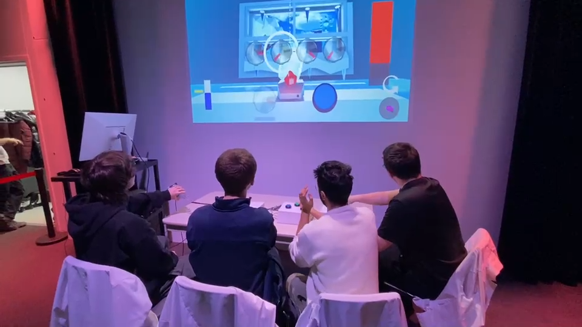

#### Mercredi
- Débuts de changements selon les notes que j'ai prises hiers
    - Événement vortex plus réalisable, avec meilleure UX
    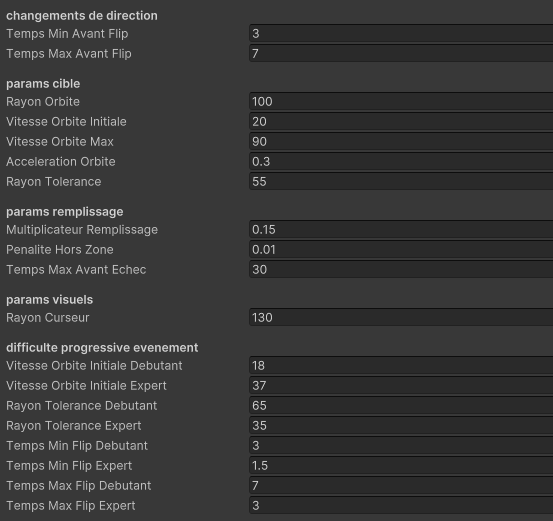

    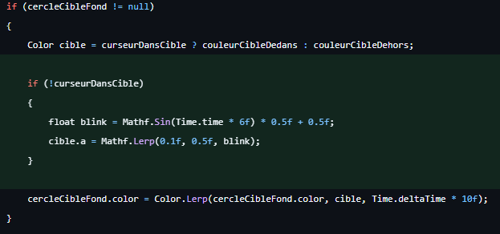

    - La potion change bien de couleur après qu'un événement soit terminé.

    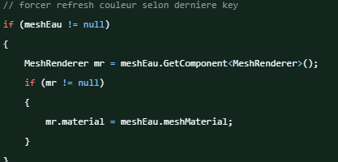

    - Seuil de l'accéléromètre accentué

    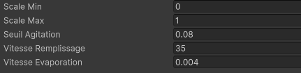

    - Début de séquences d'images dans le tutoriel progressif ( (2 images par étape, pour faire une sorte de "gif"))

    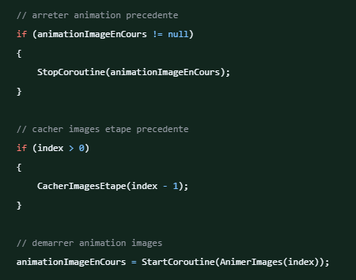

    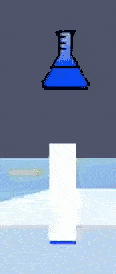

    - Textes centrés à la projection lors du tutoriel progressif

    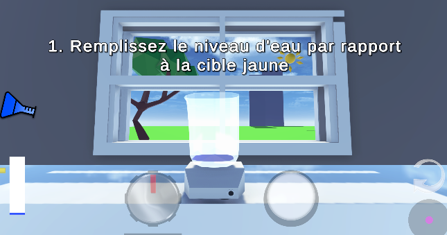

    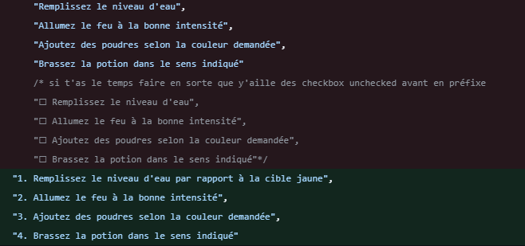

    - Faire clignotter la cible jaune du feedback visuel de la station eau

    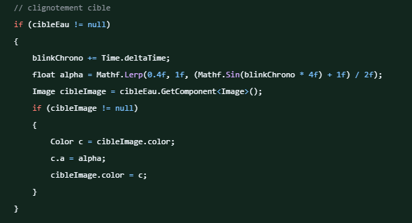

    - Début de timer visuel tout au long du jeu

    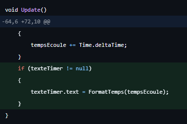

#### Jeudi
- Refonte du plan d'implémentation 3D de notre projet.  
    On se demandait comment faire en sorte que les joueurs soient côte à côte tout en ayant un espace approprié; Guillaume a eu l'idée d'utiliser des podiums en métal, et donc j'ai refait le plan d'implémentation 3D en conséquence, avec les mesures exactes, etc..
    
    
    

#### Vendredi
- Refonte de la synoptique et du plan d'implémentation 2D de notre projet.

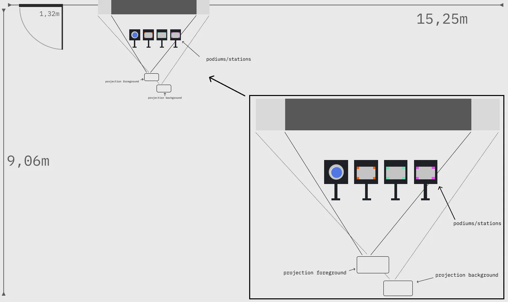

### Semaine 6.5

#### Lundi
- Refonte de la colorisation de la bande-annonce du projet.
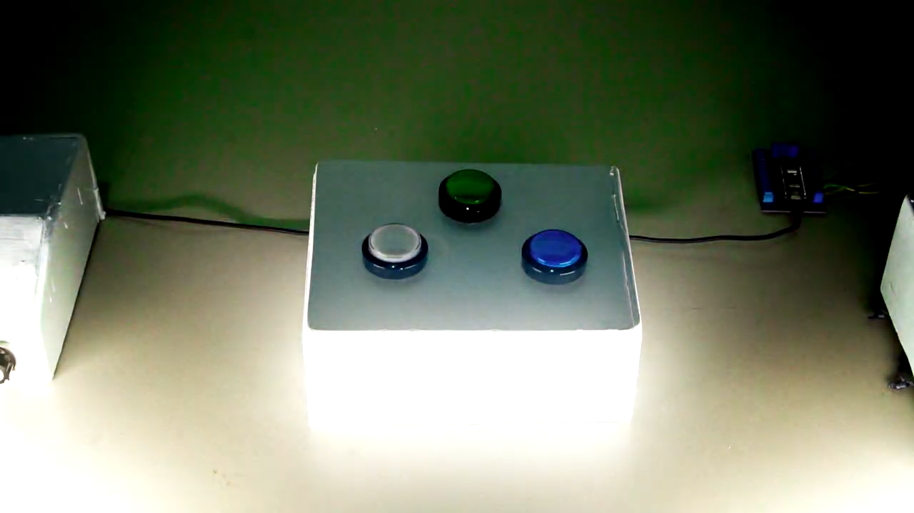

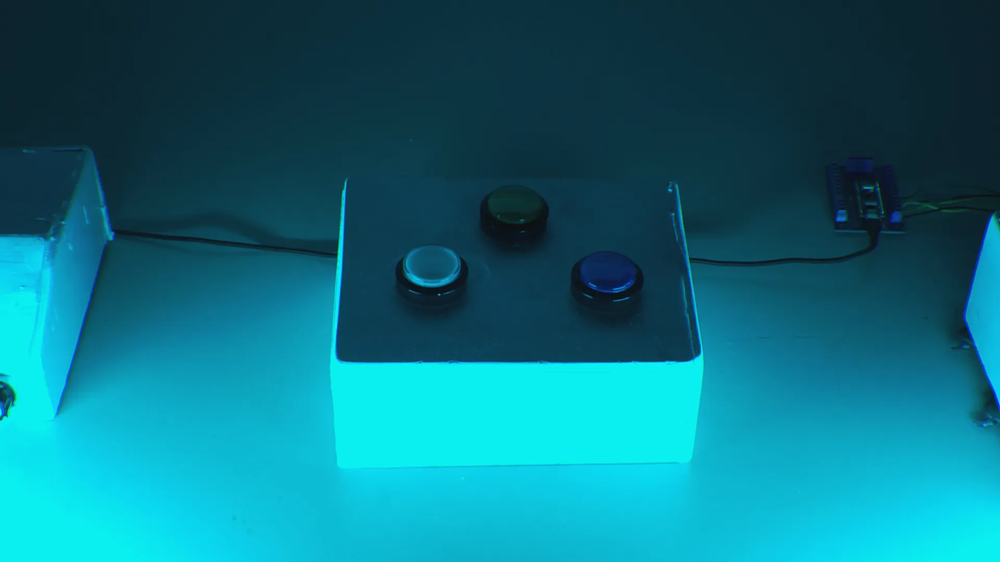

- Tests de différents codecs pour atténuer la compression YouTube.
    - Commande ffmpeg utilisé : ffmpeg -i lossless.avi -c:v libx264 -preset slow -crf 18 -profile:v high -pix_fmt yuv420p -movflags +faststart -c:a aac -b:a 320k output.mp4    
    (+ Upscale sur after effects)
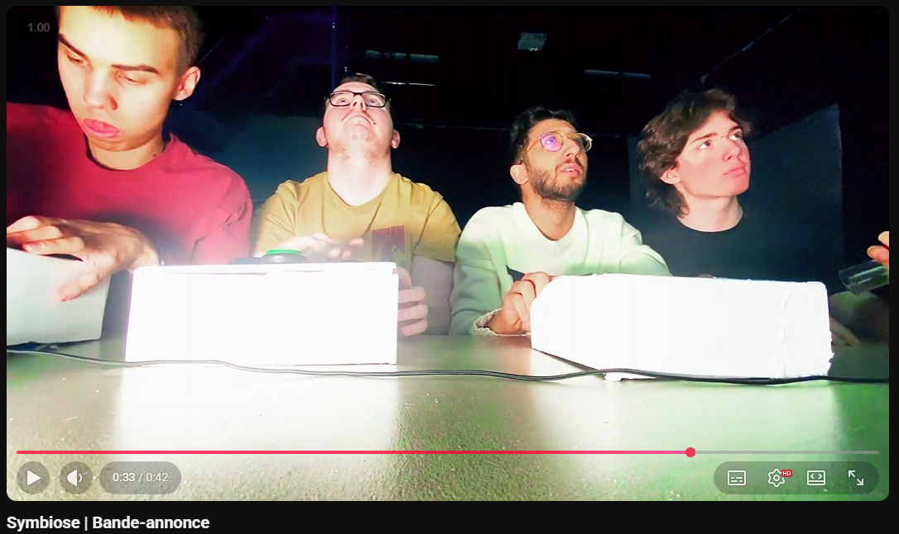

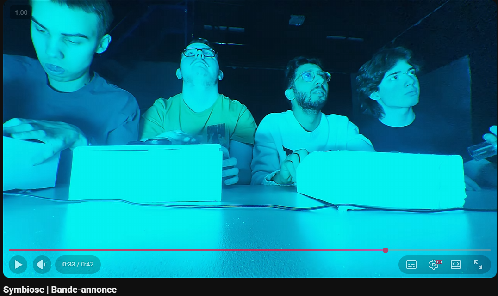

#### Mardi

#### Mercredi

#### Jeudi

#### Vendredi <!-- commence à penser à commencer le manuel around cette date là, pour être sûr que tout soit couvert -->

### Semaine 7

#### Lundi

#### Mardi

#### Mercredi

#### Jeudi

#### Vendredi

### Semaine 8

#### Lundi

#### Mardi

#### Mercredi

#### Jeudi

#### Vendredi
                                                   
