# Yannick Chamberland

## Planification

Cette section, complétée lors de la première semaine, présente les tâches individuelles **hebdomadaires** prévues.

<!--
- Planification sur 9 semaines (8 semaines de cours et 1 semaine de rattrapage) présentant les tâches individuelles hebdomadaires prévues.
- Au moins une tâche par semaine. Les tâches ne peuvent pas se répéter et doivent être suffisamment précises.
- Les tâches doivent être cohérentes avec celles des autres membres de l’équipe et avec le concept du projet, et être mises à jour en continu.
- Critères :
    - Intention et concept clairs
    - Description approfondie de la conception sonore et visuelle
    - Planification détaillée du contenu multimédia à intégrer
    - Planification technique rigoureuse
-->

### Semaine 1
- Faire la scène 3D         
- Modéliser le labo (murs, sol)  
### Semaine 2
- Modéliser le bureau         
- Modéliser le bécher          
### Semaine 3
- Modéliser la flasque qui contient l'eau     
- Construction la scène 3D sur Unity (assemblage)
- Projection vidéo (setup projecteurs, installation physique)
### Semaine 4
- Modéliser la fenêtre        
- Coder les capteurs (le knob et les 3 boutons)
### Semaine 5
- Modéliser le décor derrière la fenêtre (des arbres, plaine, des tours, soleil)      
- Coder les animations du décor dans unity selon les événements. (animation unity de l’événement crystal) 
### Semaine 6
- Intégrer les sons des événements dans unity.
- Déboguer au besoin
### Semaine 6.5
- Modéliser la main lowpoly qui tient la flasque
### Semaine 7
- Déboguer au besoin dans unity
### Semaine 8
- Être présent lors de la présentation      
- Contrôle qualité
## Journal de bord

Cette section, complétée **quotidiennement** pendant l’exécution du projet, documente le travail individuel réellement réalisé chaque jour.

<!--
- Une entrée par jour sur 8 semaines (8 semaines à partir de la semaine 2).
   - Un total d'au moins 40 entrées uniques!
- Chaque jour :
    - Documentstion visuelle et/ou sonore du travail effectué
    - Lien vers les billets GitHub résolus
- Démarche rigoureuse de validation de la qualité
- Démonstration d'autonomie.
- Exécution technique précise et complète.
- Évaluation réfléchie de la contribution individuelle au travail d’équipe.
-->

### Semaine 2

#### Lundi

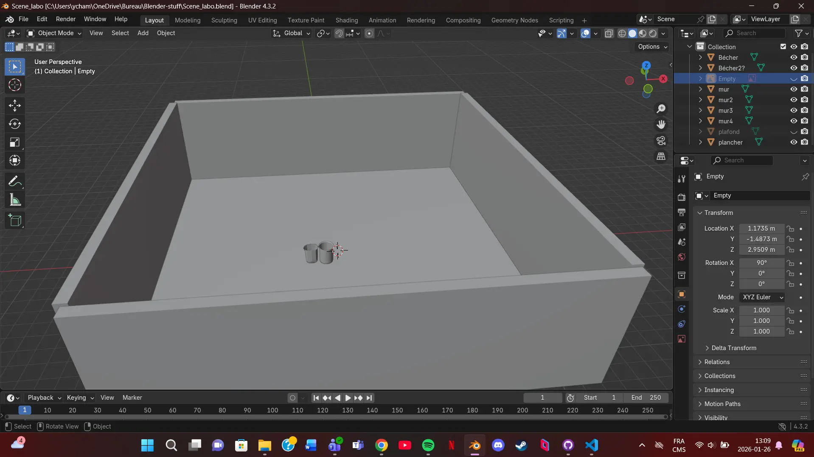
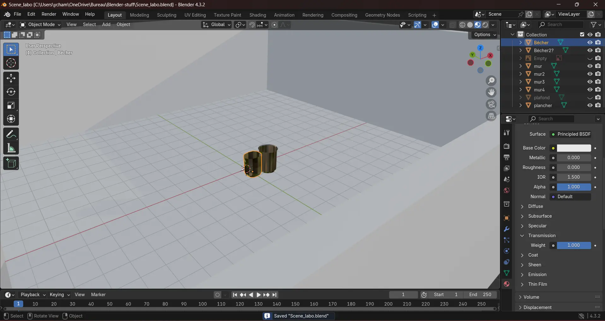
#### Mardi
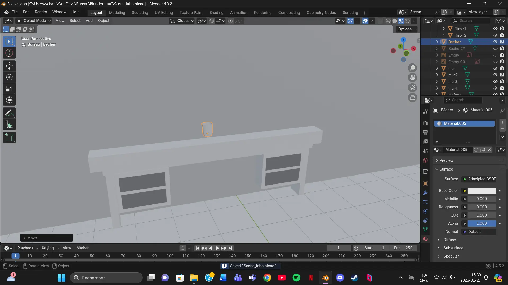
#### Mercredi
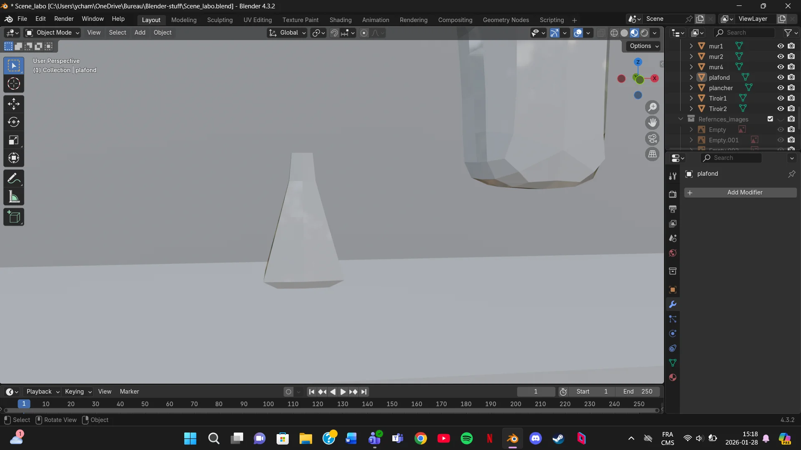
#### Jeudi
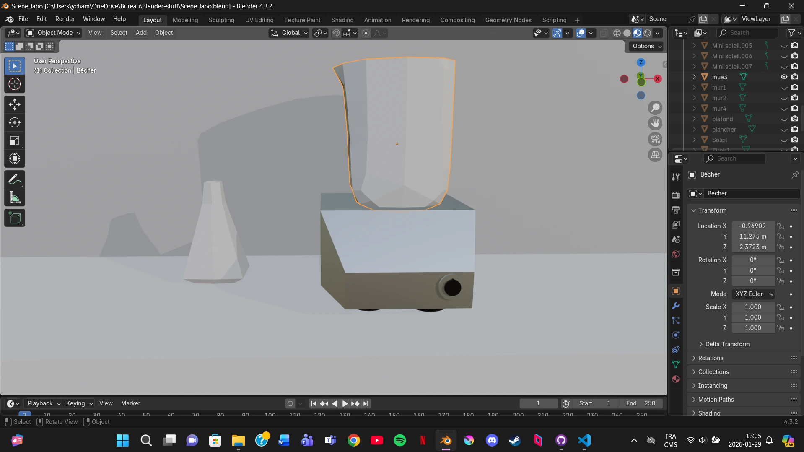
#### Vendredi
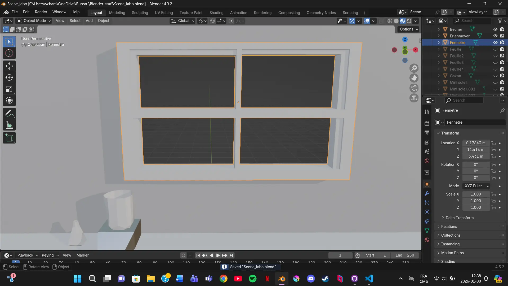
### Semaine 3

#### Lundi
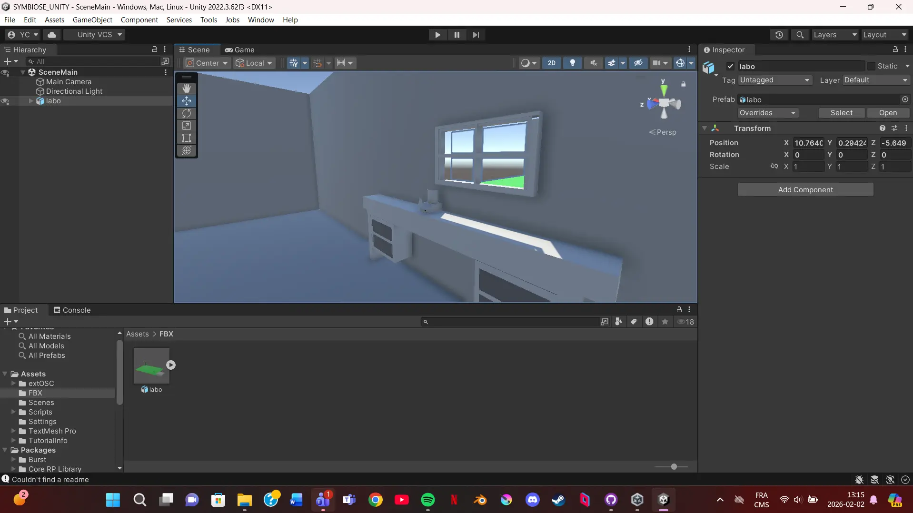
#### Mardi
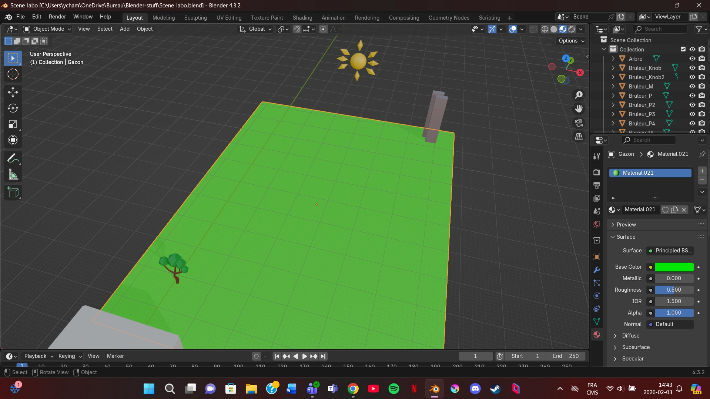
#### Mercredi
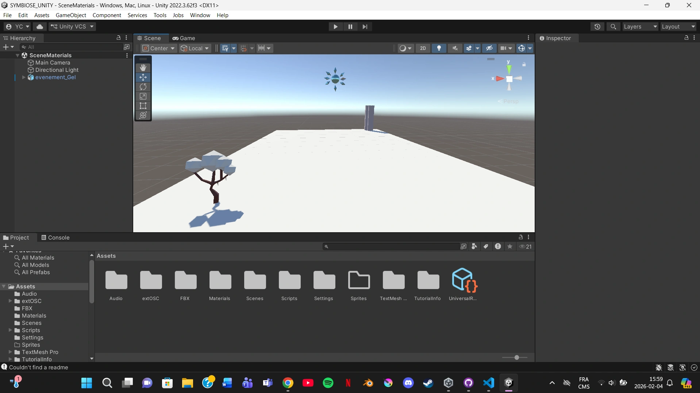
#### Jeudi
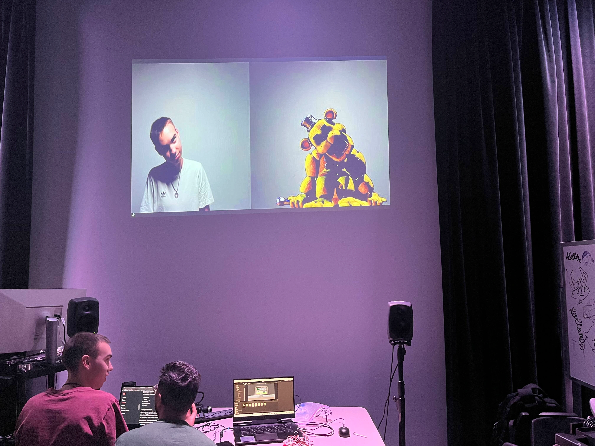
#### Vendredi
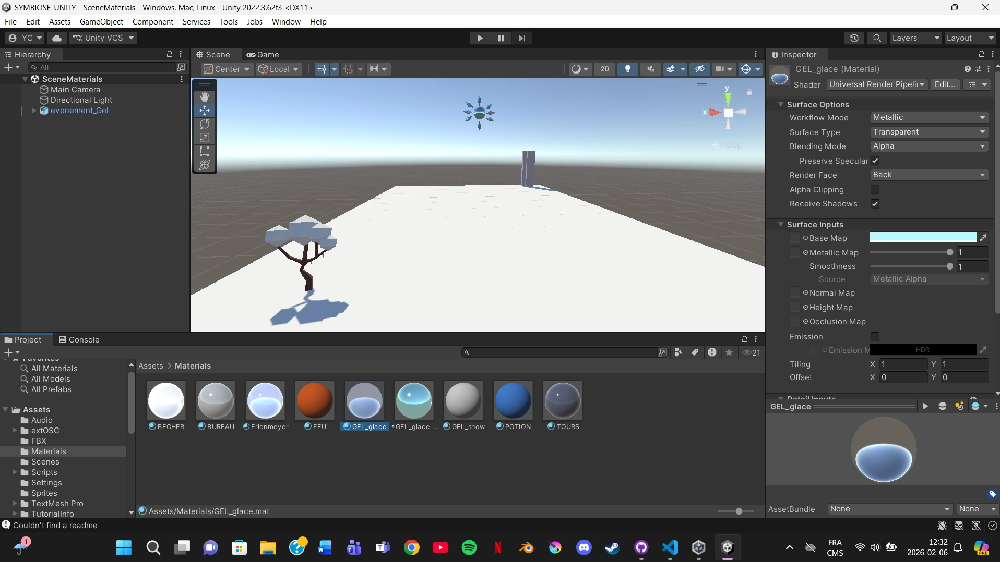
### Semaine 4

#### Lundi
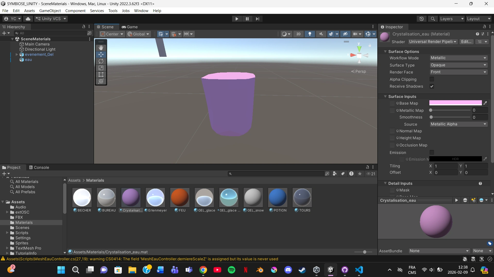
#### Mardi
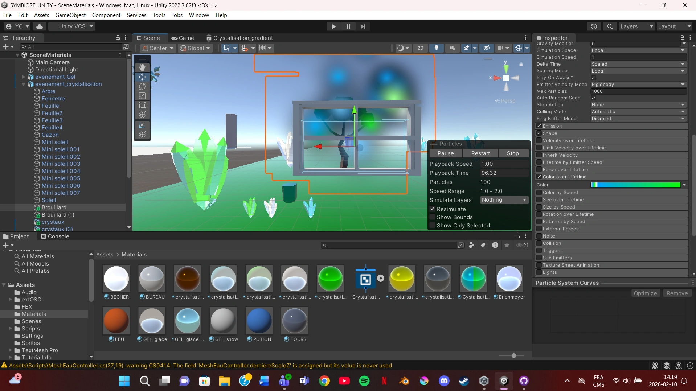
#### Mercredi
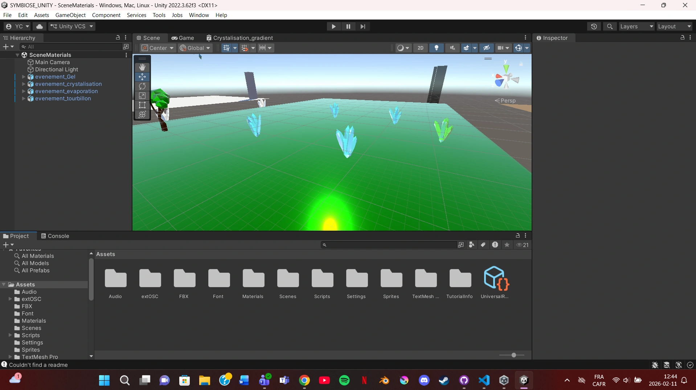
#### Jeudi

#### Vendredi

### Semaine 5

#### Lundi

#### Mardi

#### Mercredi

#### Jeudi

#### Vendredi

### Semaine 6

#### Lundi

#### Mardi

#### Mercredi

#### Jeudi

#### Vendredi

### Semaine 6.5

#### Lundi

#### Mardi

#### Mercredi

#### Jeudi

#### Vendredi

### Semaine 7

#### Lundi

#### Mardi

#### Mercredi

#### Jeudi

#### Vendredi

### Semaine 8

#### Lundi

#### Mardi

#### Mercredi

#### Jeudi

#### Vendredi
                                                   
