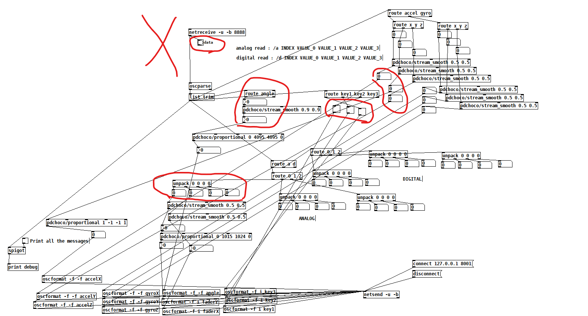
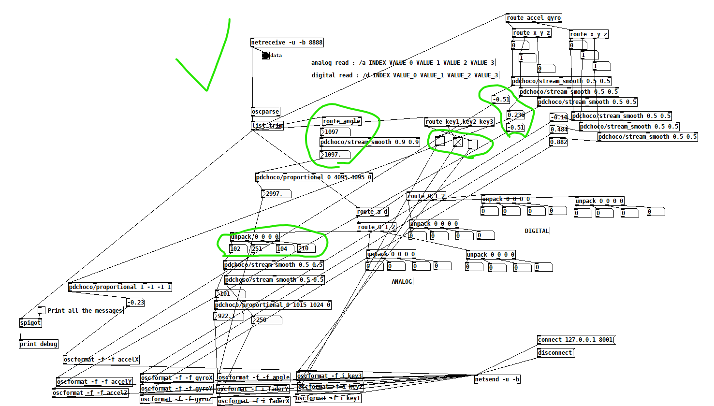

# Exposition

Cette section documente l'exposition publique du projet.

## Permanence 

Ce tableau indique les responsables quotidiens de l’exposition, désignés par chaque équipe pour assurer la permanence pendant la semaine.

Horaire

12 à 8h/20h 

| Jour       | Responsable |
|------------|-------------|
| Lundi      |    Ryan de 11.5 à 3.5 / Benjamin de 3.5 à 8 **Ryan** ouvre l'oeuvre|
| Mardi      |    Ryan, Yannick, Walid, Benjamin de Toute la journée  **Benjamin** ouvre l'oeuvre |
| Mercredi   |    Yannick et Ryan de 11.5 à 3.5 / Walid et Ben 3.5 à 8 **Yannick** ouvre l'oeuvre|
| Jeudi      |    Ryan, Yannick et Walid de 11.5 à 3.5 / Walid et Benjamin de 3.5 à 8 **Walid** ouvre l'oeuvre |
| Vendredi   |    Ryan, Yannick, Walid, Benjamin Toute la journée  |

## Procédure d’ouverture quotidienne

Cette section décrit les étapes nécessaires pour ouvrir l’installation chaque matin.
Elle a pour objectif de garantir une mise en place cohérente, sécuritaire et fidèle au projet, quel que soit le responsable de permanence.

<!-- 
Chaque composante de l’installation est détaillée ci-dessous avec :
- une description,
- les étapes d'ouverture
- des liens utiles,
- des photos de référence.
-->

<!-- (à adapter selon la conversion du code platformio en ethernet + l'ordi dans salle matrice) -->
<br>

Voici les étapes, en ordre, pour faire l'ouverture quotidienne du projet :

---

#### 1. Ouvrir les deux ordinateurs et s'y connecter
- Les mots de passes sont dans le groupe teams
- Chemins d'accès avec tous les dossiers du projet :
    - Sur le premier ordinateur (la tour) : ```C:\symbiose-582-601MO_unity_arduino```   <sub>*à l'exception du projet QLC+ qui lui, se trouve sur le bureau (<u>qqqq.qxw</u>)*</sub>
    

    - Sur le deuxième (le laptop) : ```Documents\Github\symbiose-582-601MO_unity_arduino```

---

#### 2. Ouvrir le patch Pure Data du projet
- [***Comment est constitué le patch Pure Data en détail***](https://les-chimistes.github.io/symbiose/#/exposition/?id=comment-est-constitu%C3%A9-le-patch-pure-data-en-d%C3%A9tail)
- Le patch Pure Data se trouve dans le dossier ```C:\symbiose-582-601MO_unity_arduino``` **```\SYMBIOSE_ETHERNET\ joystick_atom_controller\osc_udp_controller-atompoe.pd```**
- S'assurer que les données des stations sont bien reçues dans Pure Data.
    - Normalement, le bang doit être **continuellement noircit** (démontrant que le flux de données est bien reçu)          
    En conséquence, les valeurs des stations **ne devraient pas être à 0.**
    <!-- 
     -->

<div class="img-duo">
  <figure>
    
    <figcaption>Les données ne sont pas reçues dans le pd</figcaption>
  </figure>
  <figure>
    
    <figcaption>Les données sont bien reçues dans le pd</figcaption>
  </figure>
</div>

- Si les données ne sont **PAS BIEN REÇUES**, poursuivre l'étape 2.5. Si elles sont **BIEN REÇUES**, poursuivre à l'étape 3.

#### 2.5. Quoi faire si les données ne sont pas bien reçues dans le Pure Data
- Il va falloir démonter une face de chacune des boîtes pour ensuite appuyer sur le bouton de hard reset de chaque Atom.
- 1. Idéalement, démonter la face **avant** de la boîte, celle à l'opposée du mur, celle à l'opposée de l'embout ethernet, celle en **face** du joueur.


#### Comment est constitué le patch Pure Data en détail

## Documentation vidéo finale

<!-- Intégration d’une vidéo : méthode 1 (vidéo hébergée sur YouTube, pouvant être non répertoriée publiquement)
-->
<!-- 
[](http://www.youtube.com/watch?v=ABWCq8j8qys)
-->

<!-- Intégration d’une vidéo : méthode 2 (vidéo locale)
 -->
<!-- 
 
-->
