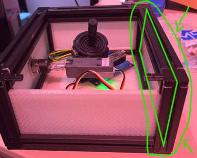
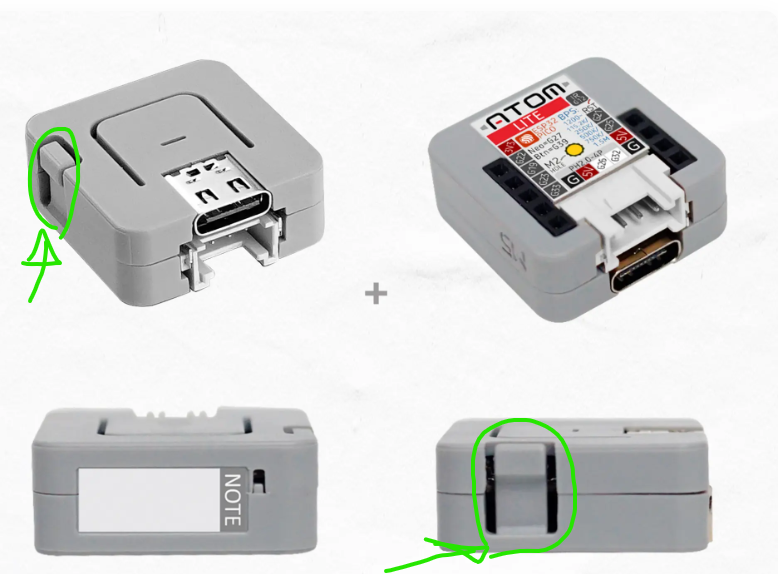
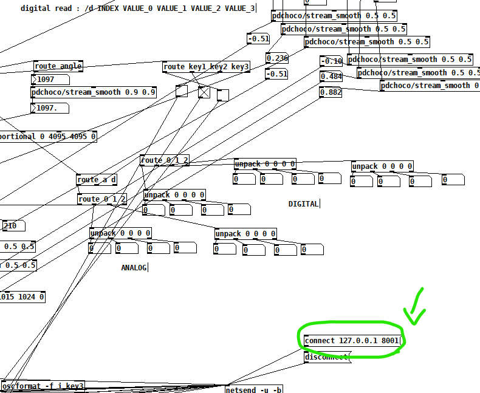
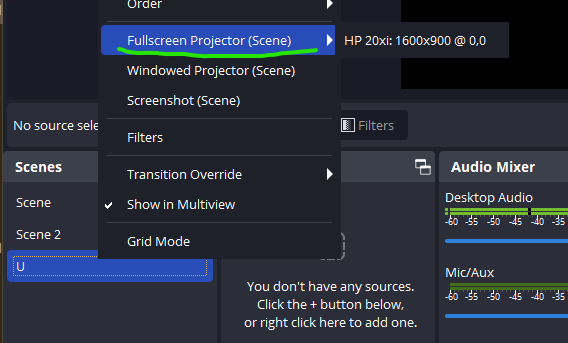
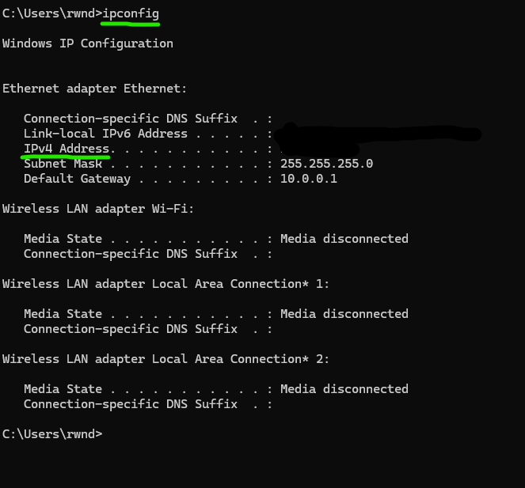
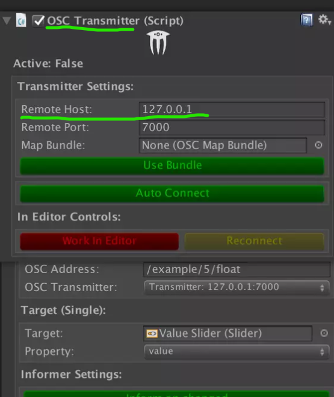

# Exposition

Cette section documente l'exposition publique du projet.

## Permanence 

Ce tableau indique les responsables quotidiens de l’exposition, désignés par chaque équipe pour assurer la permanence pendant la semaine.

Horaire

12 à 8h/20h 

| Jour       | Responsable |
|------------|-------------|
| Lundi      |    Ryan de 11.5 à 3.5 / Benjamin de 3.5 à 8 **Ryan** ouvre l'oeuvre|
| Mardi      |    Ryan, Yannick, Walid, Benjamin de Toute la journée  **Benjamin** ouvre l'oeuvre |
| Mercredi   |    Yannick et Ryan de 11.5 à 3.5 / Walid et Ben 3.5 à 8 **Yannick** ouvre l'oeuvre|
| Jeudi      |    Ryan, Yannick et Walid de 11.5 à 3.5 / Walid et Benjamin de 3.5 à 8 **Walid** ouvre l'oeuvre |
| Vendredi   |    Ryan, Yannick, Walid, Benjamin Toute la journée  |

## Procédure d’ouverture quotidienne

Cette section décrit les étapes nécessaires pour ouvrir l’installation chaque matin.
Elle a pour objectif de garantir une mise en place cohérente, sécuritaire et fidèle au projet, quel que soit le responsable de permanence.

<!-- 
Chaque composante de l’installation est détaillée ci-dessous avec :
- une description,
- les étapes d'ouverture
- des liens utiles,
- des photos de référence.
-->

<!-- (à adapter selon la conversion du code platformio en ethernet + l'ordi dans salle matrice) -->
<br>

Voici les étapes, en ordre, pour faire l'ouverture quotidienne du projet :

---

#### 1. Ouvrir les deux ordinateurs et s'y connecter
- Les mots de passes sont dans le groupe teams
- Chemins d'accès avec tous les dossiers du projet :
    - Sur le premier ordinateur (la tour) : ```C:\symbiose-582-601MO_unity_arduino```   <sub>*à l'exception du projet QLC+ qui lui, se trouve sur le bureau (<u>qqqq.qxw</u>)*</sub>
    

    - Sur le deuxième (le laptop) : ```Documents\Github\symbiose-582-601MO_unity_arduino```

---

#### 2. Ouvrir le patch Pure Data du projet

- [***Comment est constitué le patch Pure Data en détail***](pd.md)
- Normalement, le pure data devrait déjà être ouvert, mais si ce n'est pas le cas;
- Le patch Pure Data se trouve dans le dossier ```C:\symbiose-582-601MO_unity_arduino``` **```\SYMBIOSE_ETHERNET\ joystick_atom_controller\osc_udp_controller-atompoe.pd```**
- S'assurer que les données des stations sont bien reçues dans Pure Data.
    - Normalement, le bang doit être **continuellement noircit** (démontrant que le flux de données est bien reçu)          
    En conséquence, les valeurs des stations **ne devraient pas être à 0.**


<br>
<div class="img-duo">
  <figure>
    
    <figcaption>Les données ne sont pas reçues dans le pd</figcaption>
  </figure>
  <figure>
    
    <figcaption>Les données sont bien reçues dans le pd</figcaption>
  </figure>
</div>
<br>

- Si les données ne sont **PAS BIEN REÇUES**, poursuivre l'étape 2.5. Si elles sont **BIEN REÇUES**, poursuivre à l'étape 3.

#### 2.5. Quoi faire si les données ne sont pas bien reçues dans le Pure Data
- Il va falloir démonter une face de chacune des boîtes pour ensuite appuyer sur le bouton de hard reset de chaque Atom.
- 1. Idéalement, démonter la face **avant** de la boîte, celle à l'opposée du mur, celle à l'opposée de l'embout ethernet, celle en **face** du joueur.

<div class="img-half">



</div>

- 2. Appuyer sur le bouton de reset du Atom de chaque station (ou celles qui n'envoient aucune donnée)

<div class="img-half">



</div>

- 3. Remettre les/la faces enlevées

- 4. Vérifier sur Pure Data si les données sont maintenant bien reçues

#### 3. Ouvrir le projet Unity
- 1. Appuyer sur le message **"connect 127.0.0.1 8001"** sur pure data

<div class="img-half">



</div>

- 2. Ouvrir le projet Unity (Unity Hub -> Projects -> *le projet est déjà dans la liste*)
- 3. Lancer le play mode, s'assurer de ne pas changer le zoom (important pour la projection)
- 4. Vérifier si les stations marchent (donc aller verser de l'eau avec l'accéléromètre, test chaque station etc.)
- 5. Si les stations marchent, passer à l'étape 4
- 6. Si les stations **ne marchent pas**, regarder la console Unity pour voir si l'OSC est bien reçu.

#### 4. Ouvrir le projet Touch Designer & QLC+
- 1. Ouvrir le projet **Touch Designer** (```C:\symbiose-582-601MO_unity_arduino\SYMBIOSE_TD\SYMBIOSE_TD.toe```)
- 2. Ouvrir le projet **QLC+** (```Desktop\qqqq.qwx```)
- 3. Aller dans l'onglet virtual console sur QLC+ (dans les onglets en bas)
- 4. Activer le play mode QLC+

<div class="img-half">


</div>

- 5. Faire un test sur le jeu (se laisser mourir, voir si la lumière devient rouge)
- 6. Si ne marche pas, s'assurer que dans le OSC in du touch designer, même port que sur le OSC Transmitter dans Unity **dans le game object OSCLocal** (8006, normalement).

#### 5. Ouvrir le premier projecteur + OBS
- Si le/les projecteurs ne sont pas déjà ouvert;
- 1. Se rendre sur le site/ip du premier projecteur (ouvrir un navigateur, ```192.168.1.182```)                             
     Mot de passe + nom sur teams
- 2. Allumer le projecteur à partir du remote control (le gros bouton pour allumer)

<br>
<div class="img-duo">
  <figure>
    
    <figcaption>1</figcaption>
  </figure>
  <figure>
    
    <figcaption>2</figcaption>
  </figure>
</div>
<br>

- 3. Attendre que le projecteur s'allume (checker dans le studio si ça s'allume, lumière bleu)
- 4. Quand allumé, ouvrir OBS, se diriger dans la scène "U"
- 5. Retourner sur Unity, aller en play mode et attendre que le jeu soit bien chargé
- 6. Retourner sur OBS, faire clique droit sur la scène "U" et l'ouvrir dans le projecteur (1920x1200)
<div class="img-half">



</div>

- À partir de là, tout est fait pour le premier ordinateur.

#### 6. Se diriger sur le deuxième ordi (laptop), ouvrir le projet Touch Designer et OBS
- Si 2ème projecteur déjà allumé, continuer à l'étape 6.2.
- 1. Se rendre sur le site/ip du deuxième projecteur (ouvrir un navigateur, ```192.168.1.146```)                             
     Mot de passe + nom sur teams
- 2. Allumer le projecteur à partir du remote control


- 3. Ouvrir le projet Touch Designer (```Documents\Github\symbiose-582-601MO_unity_arduino\SYMBIOSE_TD\SYMBIOSE_TD.toe```)
    - Aller en mode perform, mettre l'onglet perform en plein écran

<br>
<div class="img-duo">
  <figure>
    
    <figcaption>1</figcaption>
  </figure>
  <figure>
    
    <figcaption>2</figcaption>
  </figure>
</div>
<br>

- 4. Ouvrir OBS
    - Aller dans la scène "TD"
    - Ouvrir la scène dans le projecteur (EPSON PJ 1920x1080)
- 5. S'assurer que ça marche
    - (aller dans le studio, voir si la 2ème projection est bien présente, faire le tutoriel, si par exemple, lorsqu'on atteint la cible de la station eau et que la projection change en conséquence, ça marche)
    - Si ça ne marche pas, aller à l'étape 7.
    
#### 7. Quoi faire si le touch designer de la deuxième projection ne reçoit pas de données   
- Demander à quelqu'un de faire le jeu (genre le tutoriel), aller voir sur le laptop, sur touch designer, si les données dans le CHOP OSCin sont bien reçues (genre quand la cible de l'eau est atteinte, la channel eau/deplacer devrait être à 1 momentanément et faire un pulse sur le TOP Feedback)

- Si ce n'est pas le cas, alors c'est probablement un problème de communication entre les 2 ordinateurs;
- 1. Ouvrir un invite de commande (win+r -> cmd), taper "```ipconfig```", l'ipv4 devrait être "```192.168.1.13```"

<div class="img-half">



</div>

    
- 2. Aller sur le premier ordinateur, s'assurer que l'ip est la même dans le "Remote host" du OSC Transmitter (extOSC) dans le game object "_OSC" sur Unity, si ce n'est pas le cas, mettre l'ip du deuxième ordinateur

<div class="img-half">



</div>
    
- 3. Vérifier si ça marche

#### Comment faire la fermeture de l'oeuvre?
- 1. Fermer seulement Unity, touch designer, OBS et QLC+ sur le premier ordinateur
- 2. Fermer touch designer sur le deuxième ordinateur
- 3. Déconnecter le compte des 2 ordinateurs (menu windows, déconnecter)
- 4. Fermer le laptop (le plier)

## Documentation vidéo finale

<!-- Intégration d’une vidéo : méthode 1 (vidéo hébergée sur YouTube, pouvant être non répertoriée publiquement)
-->
<!-- 
[](http://www.youtube.com/watch?v=ABWCq8j8qys)
-->

<!-- Intégration d’une vidéo : méthode 2 (vidéo locale)
 -->
<!-- 
 
-->
