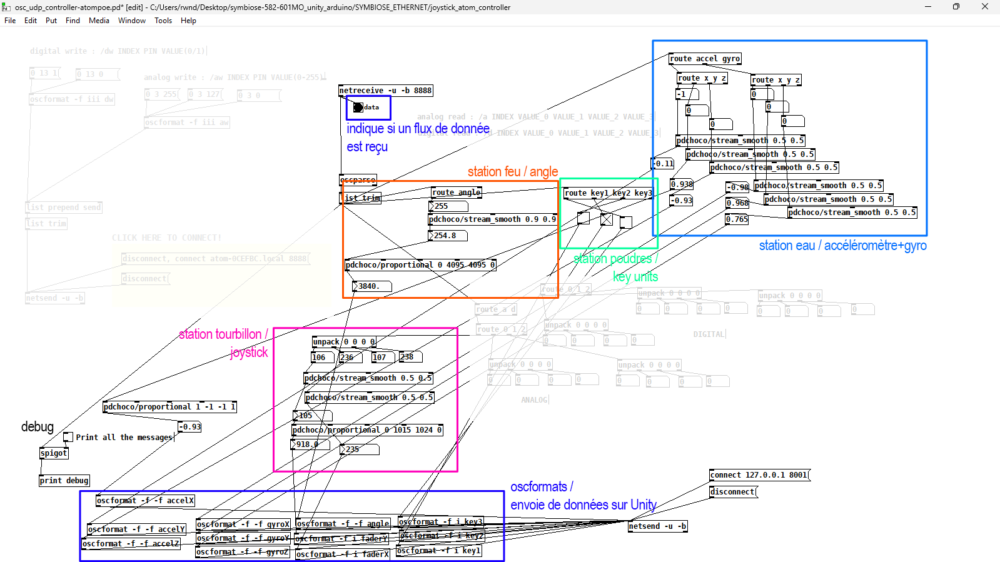

# Comment est constitué le patch Pure Data en détail

La réception de données dans le patch pd est divisé en quatre partie :

- **La station eau (AtomS3 + atom) envoie 6 données (floats)**
    - Les données de l'accéléromètre (X, Y, Z), va de -1 à 1.
    - Les données du gyroscope (X, Y, Z)
    - La station fait utilisation d'un lissage du flux, pour atténuer la sensibilité de l'accéléromètre et du gyroscope. **(pdchoco/stream_smooth 0.5 0.5)**
    - oscformats/adresses osc :
        - accelX (float)
        - accelY (float)
        - accelZ (float)
        - gyroX (float)
        - gyroY (float)
        - gyroZ (float)
    - [Plus d'informations](https://t-o-f.info/aide/#/m5stack/atomS3/mpu6886/)
- **La station feu (Atom + angle unit) envoie une seule donnée (float)**
    - La station fait aussi utilisation d'un "lissage" du flux (pour atténuer les interférences/fluctuations) **(pdchoco/stream_smooth 0.9 0.9)**
    - Ensuite on "flip" les valeurs pour avoir le maximum situé au minimum et vice-versa **(pdchoco/proportional 0 4095 4095 0)**, lorsque le angle est à 4095, pure data le met à 0, et lorsque le angle est à 0, pure data le met à 4095. (puisque sur la boîte, le angle unit est inversé.)
    - oscformat/adresse osc :
        - angle (float)
    - [Plus d'informations](https://t-o-f.info/aide/#/m5stack/units/angle/)
- **La station poudres (Atom + key units) envoie 3 données (int.)**
    - 1 entier pour le bouton vert
    - 1 entier pour le bouton bleu
    - 1 entier poru le bouton blanc
    - oscformats/adresses osc :
        - key1 (int.)
        - key2 (int.)
        - key3 (int.)
    - [Plus d'informations](https://t-o-f.info/aide/#/m5stack/units/key/)
- **La station joystick (nano atmega328 + atom) envoie 2 données (int.)**
    - 1 entier pour l'axe X du joystick
    - 1 entier pour l'axe Y du joystick
    - Comme pour le angle, on "flip" la valeur de l'axe X du joystick puisque celui-ci n'est pas du bon côté sur la boîte. **(pdchoco/porportional 0 1015 1024 0)**
    - oscformats/adresses osc :
        - faderX (int.) (fader car utilisation de fader units m5stack avant d'avoir le joystick)
        - faderY (int.)
    - [Plus d'informations](https://t-o-f.info/aide/#/nano/)