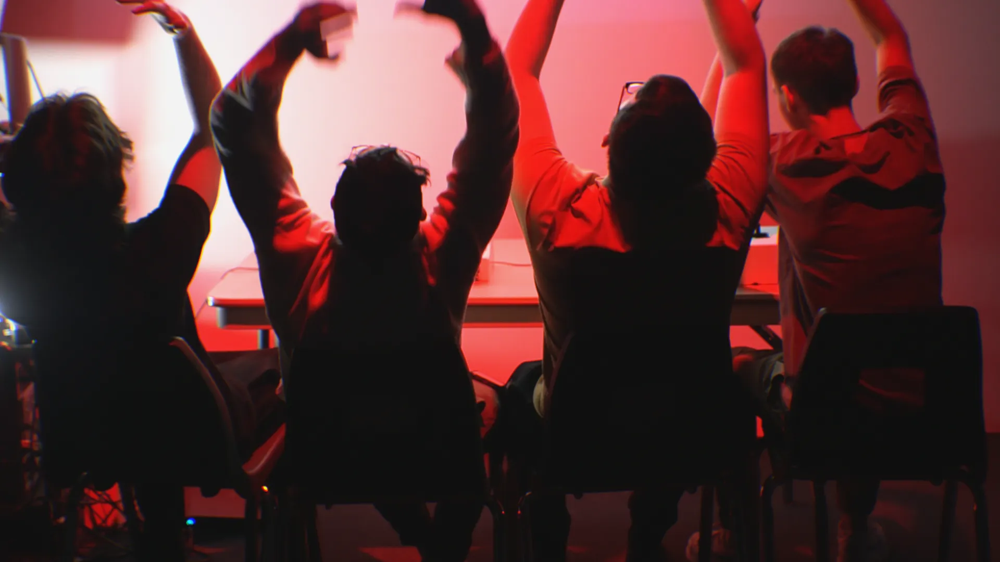
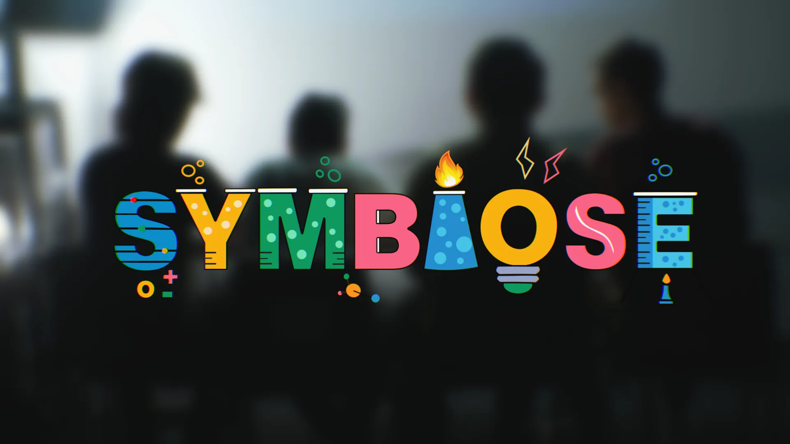
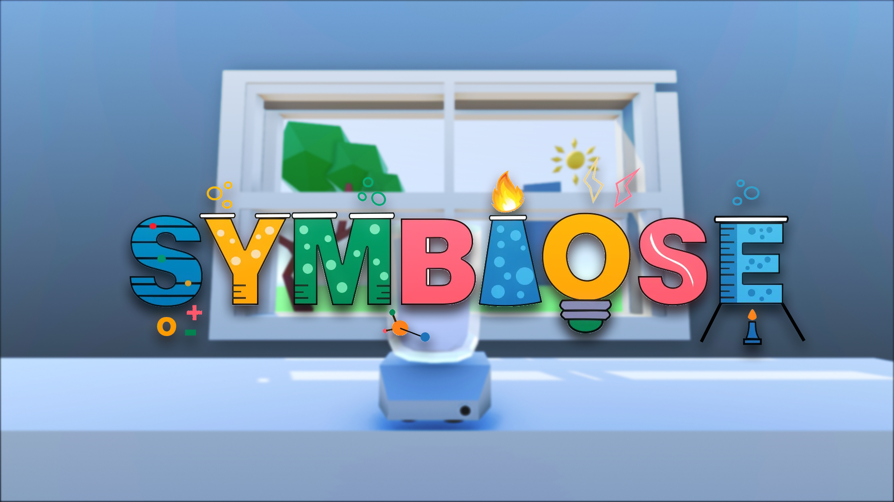
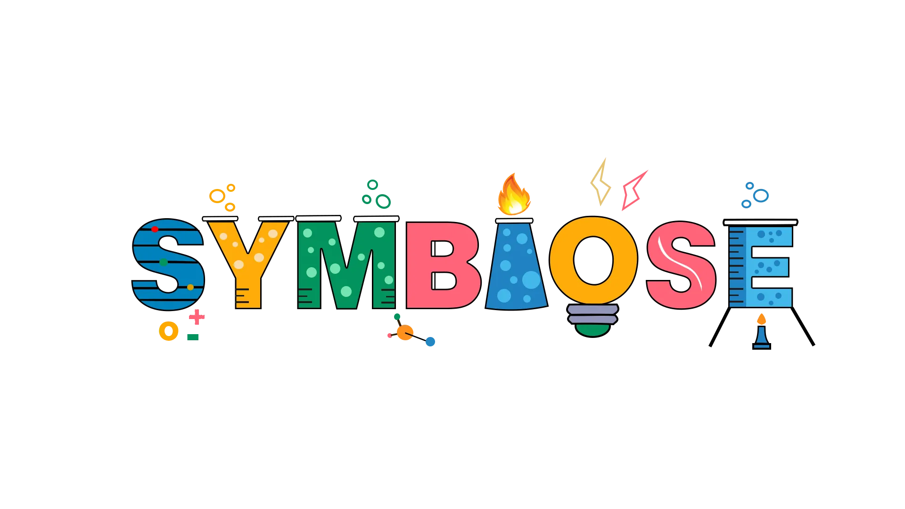

# Dossier de presse

## Fiche d’informations

**Développeur :**  
[Programme de Techniques d'intégration multimédia du Collège Montmorency](https://tim-montmorency.com/)

**Date de présentation :**  
Du 16 au 20 mars 2026.

**Forme :**  
Installation interactive

**Site Web du projet :**  
[https://les-chimistes.github.io/symbiose/#/](https://les-chimistes.github.io/symbiose/#/)

**Site Web de l'exposition collective :**  
[6tim-montmorency.com/2026](https://tim-montmorency.com/2026/#/)

**Prix :**  
Gratuit

## Description
Symbiose est une installation intéractive démontrant une potion chimique virtuelle où chaque station contrôle un ingrédient (eau, flamme, poudres, tourbillon). Les participants devront faire face à différents événements aléatoire qui perturberont l'équilibre de la potion. Leur but ultime est de faire en sorte que la potion reste stable le plus longtemps possible.

## Histoire
Des chimistes essayent tant bien que mal de stabiliser une potion face à divers événements aléatoires. Lors du processus de stabilisation, les éléments deviennent instable et les joueurs doivent travailler ensemble pour stabiliser la potion le plus longtemps possible.

## Fonctionnalités
Symbiose possède quatre stations physiques, avec un joueur par station. Chacune de ces personnes doivent faire une manipulation continue unique à leur station pour maintenir l'équilibre de la potion et la faire survivre à travers de multiples événements. Chaque station possède la capacité de contrer un certain type d'événement.

## Bande-annonce
<figure>
  

    <iframe width="100%" height="100%" src="https://www.youtube-nocookie.com/embed/Bu6LNcKxM34?disablekb=1&modestbranding=1&playsinline=1&rel=0" frameborder="0" allow="accelerometer; autoplay; encrypted-media; gyroscope; picture-in-picture; fullscreen" style="display: block; width: 100%; height: 100%;"></iframe>
  

  <figcaption style="text-align: center; font-style: italic;">
    <a target="_blank" href="https://www.youtube.com/watch?v=Bu6LNcKxM34">Symbiose | Bande-annonce</a>
  </figcaption>
</figure>
<!-- Intégration d’une vidéo : méthode 1 (vidéo hébergée sur YouTube, pouvant être non répertoriée publiquement)
-->
<!-- 

-->

<!-- Intégration d’une vidéo : méthode 2 (vidéo locale)
 -->
<!-- 
 
-->

## Images

## Logo

<!-- Autres sections d'un dossier de presse, moins pertinentes pour ce projet
## Prix et reconnaissances
## Articles sélectionnés
 -->

## À propos de l'équipe de création
Nous, "Les Chimistes", sommes une équipe de passionnés. Harmonieux, nous travaillons toujours avec passion et plaisir. Notre objectif principal avec ce projet était de surpasser nos limites individuelles pour mener à terme un projet concret et complet, qui comblerait les compétences de chacun d'entre nous.

## Crédits
Assets 3D : Yannick Chamberland      
Développement C# et Touch Designer  : Ryan Dufault       
Audio et assets 2D : Walid Cheour        
Audio et installations physiques : Benjamin Ferland 

## Contact
- Yannick Chamberland https://www.linkedin.com/in/yannick-chamberland/        
- Ryan Dufault https://ryandufault.com/     
- Benjamin Ferland https://www.linkedin.com/in/benjamin-ferland/      
- Walid Choeur https://www.instagram.com/w.a.l.eee/?hl=fr 

