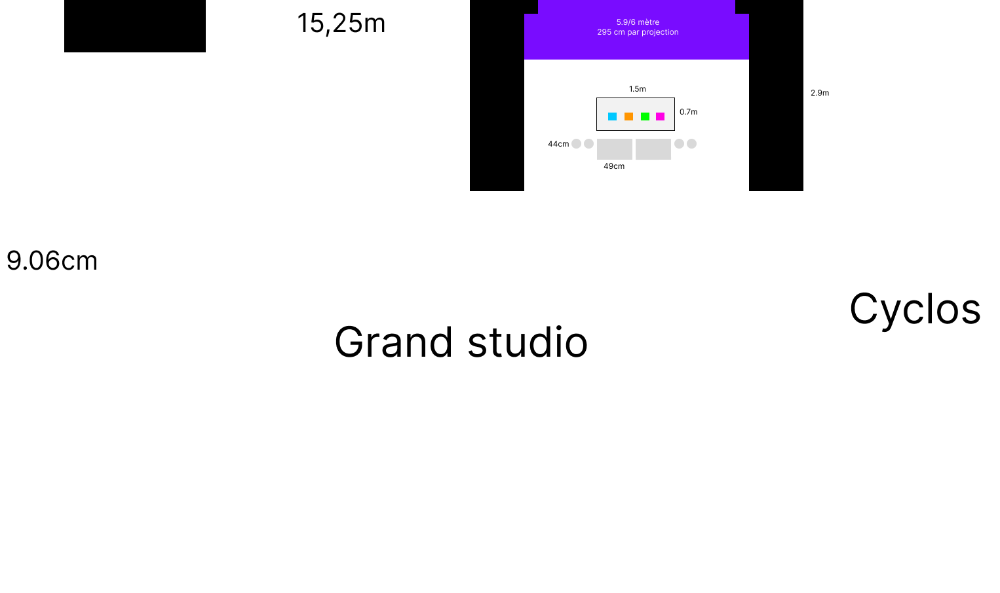
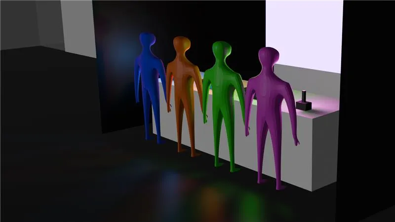
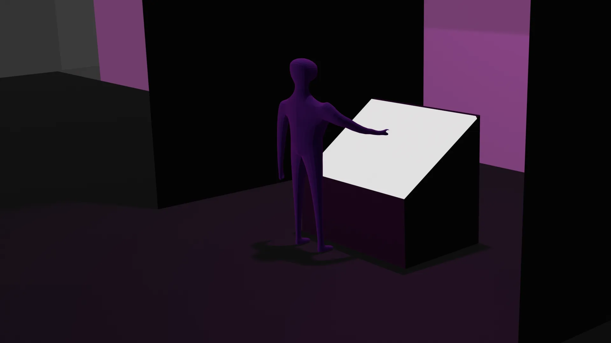
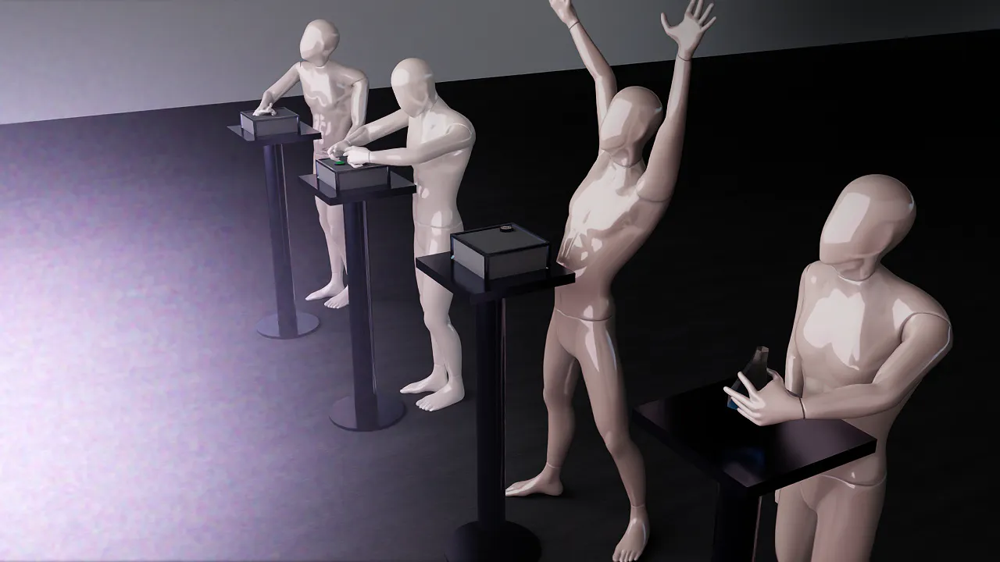

# Technique

## Équipements requis
#### Audio
- 2 haut-parleurs actifs de 5"
- 2 fils XLR conducteurs de 15'
- Carte de son multi-sorties + adaptateur powerCON
 
#### Vidéo
- 1 projecteurs Epson PowerLite 990U
- 1 câble HDMI
 
#### Lumière
- 4 lumières LED RGBAW DMX (une par station)
- 4 fils XLR conducteurs de 20'
- 1 Interface DMX Via XLR
- LEDs programmables pour le brûleur

#### Électricité
- 4 extensions électriques
 
#### Réseau
- 3 câbles ethernet
- 1 transmetteurs et 1 récepteurs (pour projection)

#### Ordinateurs
- 1 ordinateur portable (avec cable alimentation)

#### Matériaux de fabrication
- 2 panneau de bois 4x8 (Contreplaqué ½")
- Peinture blanche
- Visserie et quincaillerie
- Tissus bleu pour erlenmeyer
- Matériaux pour boîtiers (stations Feu et Poudres) 
- Forets diamant de 6mm (pour percer erlenmayer)

#### Capteurs et contrôleurs
- 1 M5Stack Atom pour transmission de données
- 2x M5Stack Pbhub pour grouper les units
- 3x M5Stack Key Unit
- 1 M5Stack Angle Unit
- 1 M5Stack IMU Unit (MPU6886)
- 1 Joystick analogique X-Y
- 1 Arduino Leonardo pour mapper joystick analogique
- Extensions M5Stack Grove
- Câbles dupont femelle-femelle (joystick analogique -> leonardo)

#### Objets physiques
- 1 Erlenmeyer 500ml
- 1 Knob de 30mm avec shaft de 6mm (pour fixer sur angle unit)
- 3 Boutons style arcade 30mm (station poudres) (vert bleu blanc)

## Logiciels Requis
#### Environnement de programmation
- Visual Studio Code / PlatformIO / Arduino IDE (Programmation des capteurs: accéléromètre, knobs, joystick)
- Unity 3D (Scène globale, réception données)
#### Design graphique / Effets visuels
- After Effects (Effets de particules pré-rendus au besoin)
- Photoshop (Textures pour le laboratoire 3D)
- Blender/Maya (Modélisation 3D)
#### Gestion de l'éclairage
- QLC+ (Éclairage)
#### Audio
- Reaper / FL Studio (Composition et design sonore)
- Synthétiseurs VST (Sons de laboratoire, événements)

## Synoptique

[**agrandir**](https://les-chimistes.github.io/symbiose/technique/synoptique.svg)

## Plan d'implémentation

## Budget estimé

| Objet| Descritpion | Prix | URL/Provenance |
| ------ | ------ | ------ | ------ |
|  |  |  | |
|  |  |  | |
|Tissus bleu|Tissus bleu pour cacher l'accéléromètre dans l'erlenmayer|~5-10$|Dollarama|
|<u> Knob de 30mm avec shaft de 6mm </u>|Knob de station feu qui sera fixé sur le angle unit|18$|[Amazon](https://www.amazon.ca/Uxcell-Black-Silver-Rotary-Potentiometer/dp/B00CQLO0B6)|
|<u> Boutons style arcade de 30mm </u>|Boutons qui seront fixé sur des key units|11$|[Amazon](https://www.amazon.ca/ehbn9-Arcade-Button-Switch-Colors/dp/B09WDRPLDP)|
|Mini tiges de bois|Tiges qui seront fixés entre les boutons arcade et les key units|~5-10$|Dollarama|
|  |  |  | |
|  |  |  | |
|<u> M5Stack IMU Unit (MPU6886) </u>|Accéléromètre|~10$|[M5Stack shop](https://shop.m5stack.com/products/6-axis-imu-unitmpu6886)|
|<u> Extensions grove </u>|Pour longues distances|~6$|[M5Stack shop](https://shop.m5stack.com/products/4pin-buckled-grove-cable)|
|<u> Joystick analogique </u>|Joystick de la station tourbillon|17$|[Amazon](https://www.amazon.ca/Muloo-JH-D202X-R4-Electric-Potentiometer-Controller/dp/B0CWGX5LG3/)|
|<u> Arduino Leonardo </u>|Pour recevoir les données du joystick en usb|34$|[Canada Robotix](https://www.canadarobotix.com/products/281?srsltid=AfmBOopji84tbsa_d6uDxBYOYMEiKoLQ7wPGqOcSx13pwFcTWci7yfxh)|
|<u> Câbles dupont femelle-femelle</u>|Connexions entre leonardo et joystick|16$|[Amazon](https://www.amazon.ca/240Pcs-Dupont-Solderless-Breadboard-Arduino/dp/B09M3T6CLH)|
|  |  |  | |
|  |  |  | |
|Contreplaqué ½"|Panneau de bois contreplaqué sur 4 par 8 pieds de 12mm (utilisé pour le caisson et le brûleur)|~80$/2|[Rona](https://www.rona.ca/fr/produit/1-2-po-x-4-pi-x-8-pi-contreplaque-depinette-standard-cp12es-0938003)|
| Peinture | Peinture pour peinturer le caisson et brûleur artisanal | 35$/950ml | [HomeDepot](https://www.homedepot.ca/produit/rust-oleum-painter-s-touch-peinture-multi-usages-en-noir-mat-946-ml/1000155179) |
| Pinceau | Pour peinturer le caisson et le brûleur artisanal | ~4$/pinceau   | [HomeDepot](https://www.homedepot.ca/produit/hdg-pinceau-a-peinture-a-copeaux-plats-de-2-pouces-50-8-mm-de-largeur-paquet-de-1-/1000738776) |
|  |  |  | |
|  |  |  | |
| Total | ~360$, avec taxes et livraison environ 450$ |