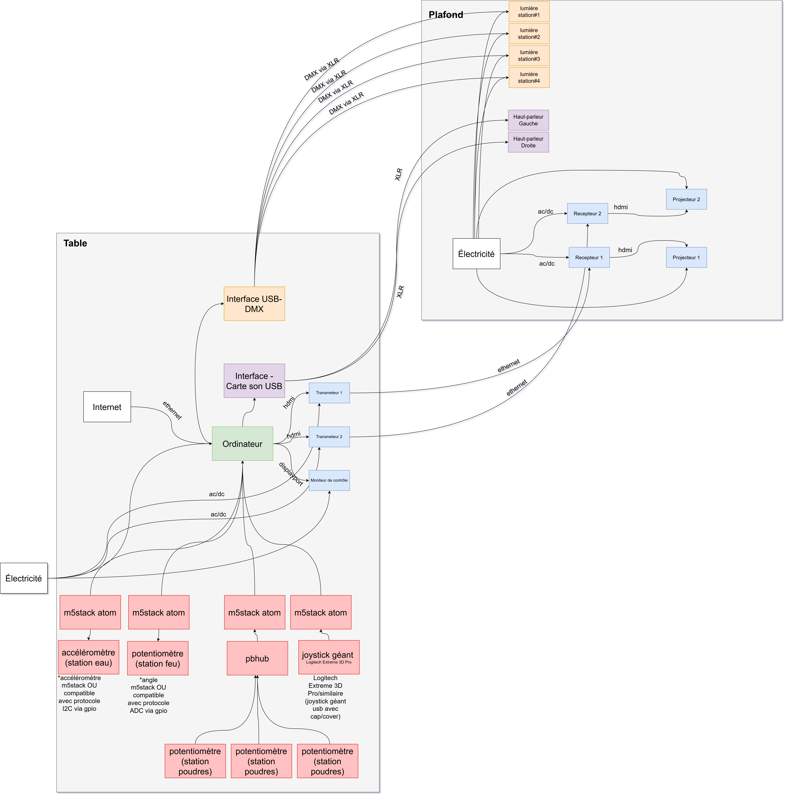

# Technique

## Équipements requis
#### Audio
- 2 haut-parleurs actifs de 5"
- 2 fils XLR 3 conducteurs de 15'
- Carte de son multi-sorties + adaptateur powerCON
 
#### Vidéo
- 2 projecteurs Epson PowerLite 990U
- 1 câble HDMI
 
#### Lumière
- 4 lumières LED RGBAW DMX (une par station)
- 4 fils XLR 3 conducteurs de 20'
- 1 Interface DMX Via XLR
- LEDs programmables pour le brûleur (station Feu) // À_PRÉCISER

#### Électricité
- 4 extensions électriques
 
#### Réseau
- 3 câbles ethernet
- 2 transmetteurs et 2 récepteurs (pour projection)

#### Ordinateurs
- 1 ordinateur portable (avec cable alimentation)

#### Matériaux de fabrication
- Bois (pour structure de table et supports)
- Peinture noire mate
- Visserie et quincaillerie
- Tissus bleu pour erlenmeyer
- Matériaux pour boîtiers (stations Feu et Poudres) 

#### Capteurs et contrôleurs
- 1 accéléromètre (station Eau)
- 4 potentiomètres rotatifs (knobs)
- 1 joystick analogique (station Tourbillon)
- 1 M5Stack Atom pour transmission de données
- 1 bouton central lumineux
- Câblage et connecteurs // À_PRÉCISER

#### Objets physiques
- 1 erlenmeyer vide
- 1 agitateur magnétique réel
- Réceptacle fermé pour eau (agitateur)

## Logiciels Requis
#### Environnement de programmation
- Visual Studio Code / PlatformIO / Arduino IDE (Programmation des capteurs: accéléromètre, knobs, joystick)
- Unity 3D (Scène globale, réception données)
#### Design graphique / Effets visuels
- After Effects (Effets de particules pré-rendus au besoin)
- Photoshop (Textures pour le laboratoire 3D)
- Blender/Maya (Modélisation 3D)
#### Gestion de l'éclairage
- QLC+ (Éclairage)
#### Audio
- Reaper / FL Studio (Composition et design sonore)
- Synthétiseurs VST (Sons de laboratoire, événements)

## Synoptique

## Plan d'implémentation

## Budget estimé // À_PRÉCISER

| Objet| Description | Prix | URL/Provenance |
| ------ | ------ | ------ | ------ |
| Erlenmeyer (250ml) | Récipient en verre pour station Eau | 15$ | [Amazon](https://www.amazon.ca/dp/B01N5R7SKK) |
| Accéléromètre MPU6050 | Capteur de mouvement pour détecter l'agitation de l'erlenmeyer | 8$ | [Amazon](https://www.amazon.ca/dp/B08T1WZNT2) |
| Tissus bleu (1m) | Tissu pour simuler l'eau dans l'erlenmeyer et cacher l'accéléromètre | 10$ | [Fabricville](https://www.fabricville.com/) |
| Potentiomètres rotatifs (x5) | Knobs pour contrôle du feu et des poudres | 25$ (5$/unité) | [Amazon](https://www.amazon.ca/dp/B07S1JWG5P) |
| LEDs programmables RGB (bande 1m) | Pour simuler le feu réel dans le brûleur | 20$ | [Amazon](https://www.amazon.ca/dp/B01LSF4Q0A) |
| Joystick analogique | Contrôleur pour le brassage/tourbillon | 12$ | [Amazon](https://www.amazon.ca/dp/B07CKVD4R5) |
| M5Stack Atom | Microcontrôleur pour transmission de données des capteurs | 35$ | [RobotShop](https://www.robotshop.com/ca/fr/) |
| Agitateur magnétique | Vrai agitateur pour effet visuel physique | 40$ | [Amazon](https://www.amazon.ca/dp/B07FKTZC1F) |
| Bouton central lumineux | Bouton de démarrage de l'expérience | 15$ | [Amazon](https://www.amazon.ca/dp/B07R2S77M9) |
| Bois MDF / Contreplaqué | Pour construire les boîtiers des stations et la table | 80$ (~20$/panneau) | [Rona](https://www.rona.ca/) |
| Peinture noire mate | Pour peinturer les structures et le joystick | 35$/950ml | [HomeDepot](https://www.homedepot.ca/produit/rust-oleum-painter-s-touch-peinture-multi-usages-en-noir-mat-946-ml/1000155179) |
| Pinceaux et outils | Pour assemblage et peinture | 20$ | [HomeDepot](https://www.homedepot.ca/) |
| Visserie et quincaillerie | Vis, écrous, supports pour assemblage | 25$ | [Rona](https://www.rona.ca/) |
| Câblage électronique | Fils, connecteurs, breadboards | 30$ | [Amazon](https://www.amazon.ca/) |
| Réceptacle hermétique | Contenant pour l'eau de l'agitateur magnétique | 10$ | [Dollarama](https://www.dollarama.com/) |
|  |  |  | |
| **Total estimé** | | **~380$** | |