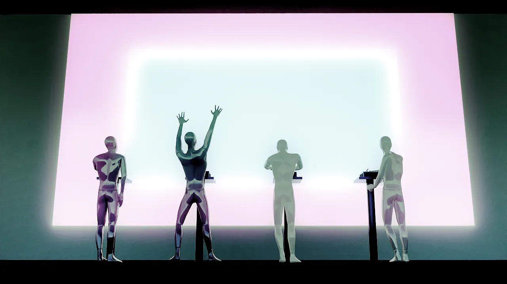
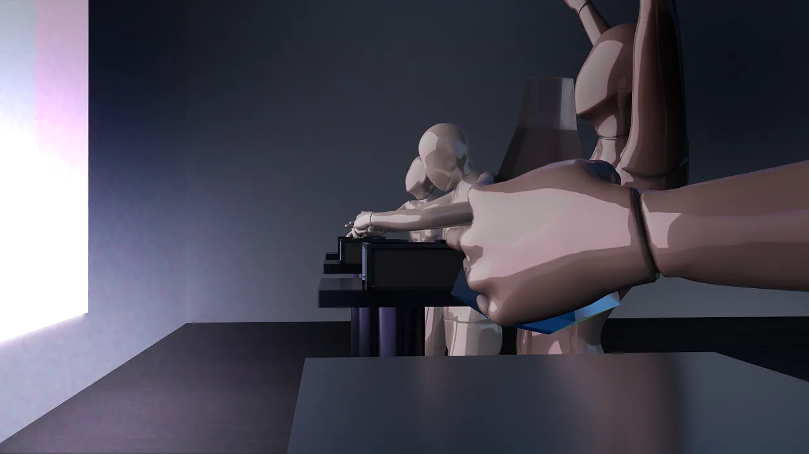
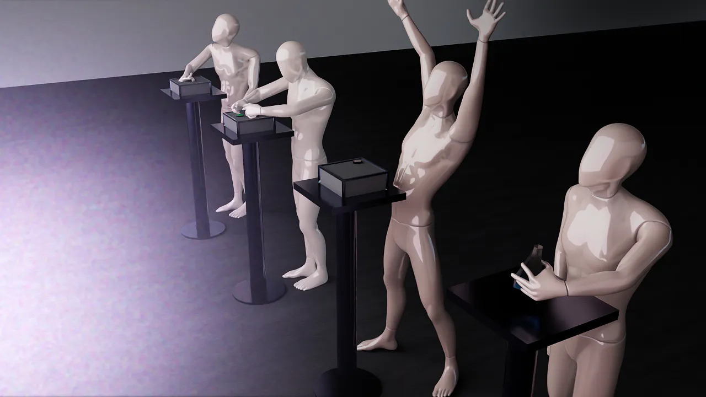
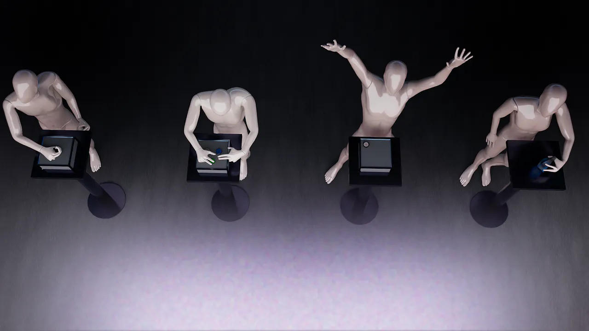

# Technique

## Équipements requis
#### Audio
- 2 haut-parleurs actifs de 5"
- 2 fils XLR conducteurs de 15'
- Carte de son multi-sorties + adaptateur powerCON
 
#### Vidéo
- 2 projecteurs Epson PowerLite 990U
- 1 câble HDMI
 
#### Lumière
- 1 lumières LED RGBAW DMX (une par station)
- 1 fils XLR conducteurs de 20'
- 1 Interface DMX Via XLR
- LEDs i2c pour brûleur

#### Électricité
- 4 extensions électriques
 
#### Réseau
- 3 câbles ethernet
- 1 transmetteurs et 1 récepteurs (pour projection)

#### Ordinateurs
- 1 ordinateur portable (avec cable alimentation)

#### Matériaux de fabrication
- 1 planche de plywood 2 par 4 1/4" ; Pour stations feu et poudres et tourbillon lors de maquette #2
- Visserie et quincaillerie
- Tissus bleu semi-transparent pour intérieur erlen meyer

#### Capteurs et contrôleurs
- 3 M5Stack ATOM PIOE pour transmission de données ethernet
- 2 M5Stack Pbhub pour grouper les units
- 6 M5Stack Key Unit
- 1 M5Stack Angle Unit
- 1 M5Stack ATOMS3
- 1 Joystick analogique X-Y
- 1 Arduino Nano

#### Objets physiques
- 1 Erlenmeyer 500ml
- 1 Knob de 30mm avec shaft de 6mm (pour fixer sur angle unit)
- 3 Boutons style arcade 60mm (station poudres) (vert bleu blanc)

## Logiciels Requis
#### Environnement de programmation
- Visual Studio Code / PlatformIO / Arduino IDE (Programmation des capteurs: accéléromètre, knobs, joystick)
- Unity 3D (Scène globale, réception données)
#### Design graphique / Effets visuels
- After Effects (Effets de particules pré-rendus au besoin)
- Photoshop (Textures pour le laboratoire 3D)
- Blender/Maya (Modélisation 3D)
- TouchDesigner (Arrière plan de la seconde projection)
#### Gestion de l'éclairage
- QLC+ (Éclairage)
#### Audio
- Reaper / FL Studio (Composition et design sonore)
- Synthétiseurs VST (Sons de laboratoire, événements)

## Synoptique

[**agrandir**](https://les-chimistes.github.io/symbiose/technique/synoptique.svg)

## Plan d'implémentation

## Budget estimé

| Objet| Description | Prix | URL/Provenance |
| ------ | ------ | ------ | ------ |
|  |  |  | |
|  |  |  | |
|<u> Knob de 30mm avec shaft de 6mm </u>|Knob de station feu qui sera fixé sur le angle unit|18.15$|[Amazon](https://www.amazon.ca/-/fr/uxcell%C2%AE-Sourcingmap-rotatifs-plastique-potentiom%C3%A8tre/dp/B07T1LDJ9P/ref=sr_1_2?__mk_fr_CA=%C3%85M%C3%85%C5%BD%C3%95%C3%91&crid=T83GCN45Y6PW&dib=eyJ2IjoiMSJ9.fNOt8DGuojZwbFY_X5sKNvAOsxFikg_m6tRXReosYHdc8JzHvQ1n3tOLpiZLrpUp8E-WW-KcNSPfzpjxUGCacLfdep1ESgAma7fhLGmm2SxdaryZ4pe4MM4lV7BImIkfxiq8SFbYCyLUtV6UZxWS2KNlDRzhIEQjvsM9DJkuuhsw-WCOFMGD1UDBwwTPIoGkrSfTB79IlFij3GD49cuzb3i75NS-Tlkt8kzzvVbYovrHYQ1ZZv3Ar88mkOyyLDMifT9yRIun_808XNuD6kTFYbWvIDbxfXXlRET4DzpgXuE.Z8mVBZeDK48u7Q6i6v1CW4iBqhp8LNIOI_uRuI75a74&dib_tag=se&keywords=Lot+de+5+boutons+de+potentiom%C3%A8tre+rotatifs+avec+cadran+de+comptage+de+0+%C3%A0+100%2C+de+6+mm+MF-A01+avec+plaque+frontale+de+40+mm+0-100+press+in&qid=1770262515&sprefix=lot+de+5+boutons+de+potentiom%C3%A8tre+rotatifs+avec+cadran+de+comptage+de+0+%C3%A0+100%2C+de+6+mm+mf-a01+avec+plaque+frontale+de+40+mm+0-100+press+in%2Caps%2C80&sr=8-2)|
|<u> Boutons style arcade de 30mm </u>|Boutons qui seront fixé sur des key units|29.88$|[Amazon](https://www.amazon.ca/EG-STARTS-Illuminated-Buttons-Operated/dp/B01M7PNCO9/ref=sr_1_12?crid=PM5VOEY0EW4O&dd=pleQKyYbAOrm0zCbnqhEsw%2C%2C&dib=eyJ2IjoiMSJ9.FZPiTZrTYUiDWI002c2QMXuede5BY-mu5A-mxPJKdUU_uR1jEEhlCbFtnSn2N44n326OA_lESvqkWjYzraiB4jbfpdrfarduQLgLsMjfjIYpE3m5oDibn0M5Z1PrecIWr6ozGf7Al3IjqPBqccH70doQmYpDR1Fd12JyjVKF9msb8sSIhDstzQ3IX0GywwfKrM4iEWTr7BTcvGo33z_Zisv2k3OWTVWBIGN91xUgsF_zOynbxkKWiZ8OuE7E93MZKwKFJ3SXrHOthjvifF3g4JNHGGC89vGLYdNjsAjBvyM.JBp_iY-YSQDVaaWbppeVBhVOTK8j-gpFQfuG_oNca5Q&dib_tag=se&keywords=100mm+arcade+buttons&qid=1770409631&refinements=p_90%3A11828088011&rnid=11828086011&sprefix=100mm+arcade+buttons%2Caps%2C534&sr=8-12)|
|<u> Joystick analogique </u>|Joystick de la station tourbillon|38.81$|[ABRA](https://abra-electronics.com/electromechanical/switches/arcade-game-switches/2d-2-axis-joystick-potentiometer-5k-clone.html)|
|  |  |  | |
|  |  |  | |
|Contreplaqué| plywood 2 par 4 1/4" (utilisé pour les 4 stations de la maquette #2)|17.76$|Home Depot|
| Peinture | Peinture pour peinturer les stations en bois de la maquette #2 | 6.27$ | HomeDepot |
| Pinceau | Pour peinturer les stations | ~2$/pinceau   | Dollarama |
| Pistolet à colle chaude | Pour coller les faces des stations ensemble | 4.60$   | Dollarama |
| Batonnets colle chaude + tiges de bois + tissus bleu | Tiges qui seront fixés entre les boutons arcade et les key units, tissus bleu pour erlen meyer (cacher accéléromètre) | 5.75$   | Dollarama |
|Carton blanc|Pour soutenir le joystick (les vis) lors de la maquette #2|2.52$|Dollarama|
|
|  |  |  | |
|  |  |  | |
| Total | 155,32$ |